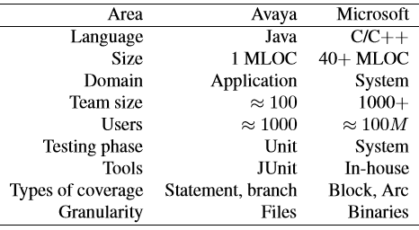

# Is 100% code coverage worth the cost?
> By: Sam Guckenheimer

Often you have code that does not have 100% test coverage. In other
words, tests don’t exercise all code paths. (The code and tests were
developed independently, and the system has evolved over time.) How much
engineering effort is worth investing to increase the test coverage of
existing code? One of the first studies(\*) of the value of code
coverage looked at this question.

## Code coverage from testing and quality

In order to understand the investment value of test coverage, we need to
answer the three questions:

1. What is defect detection effectiveness curve for X% coverage?
2. What is the effort needed to obtain X% coverage?
3. When is the incremental defect detection cost effective for a particular set of quality requirements?

### Coverage on commercial software projects

To address these issues we analyzed data from both Microsoft and Avaya
two large companies as part of a joint research project. The table below
summarizes the scale of the projects.

  

### Did higher coverage mean fewer bugs?

Yes, higher coverage was one of several potential explanations for fewer
bugs. We analyzed the data statistically and qualitatively to
investigate various research questions. While correlation does not imply
causation, post-release defects correlated to several variables
including code complexity, developer experience, the type of
functionality, and remote development teams. All these factors were
related to the level of coverage and quality, and code coverage has a
positive effect even after controlling other variables.

### But was forcing higher coverage worth the cost?

We also found that the test effort increases exponentially with test
coverage, but the reduction in field-reported bugs increased only
linearly with test coverage. This suggested that for most projects the
optimal levels of coverage are likely to be well short of 100%.
The main takeaways from this research study are:

- Code coverage should not be used alone. It should be used in conjunction with other techniques like static analysis, fault injection, etc.
- Code covered is not necessarily correct in its behavior.
- It might not be worth the effort to achieve 100% coverage for pre-existing code.

### Revisiting this research

This work shows the value of empirical assessment. It is seven years old
and was the first study we know to look at to assess the value of test
coverage. There are two further hypotheses to test that are begged by
this study:

- How much more cost-effective is test coverage created by test-driven development or other co-creation of tests and code?
- How much more cost-effective is a DevOps process using telemetry to harden testing based on live site qualities of service?

## References

\* Audris Mockus, Nachiappan Nagappan, Trung T. Dinh-Trong: Test
coverage and post-verification defects: A multiple case study. ESEM
2009: 291-301

|             |                           |
|-------------|---------------------------|
||Sam Guckenheimer works on Microsoft Visual Studio Cloud Services, including VS Team Services and Team Foundation Server. He acts as the chief customer advocate, responsible for strategy of the next releases of these products, focusing on DevOps. He has written four books on DevOps and Agile Software practices. |