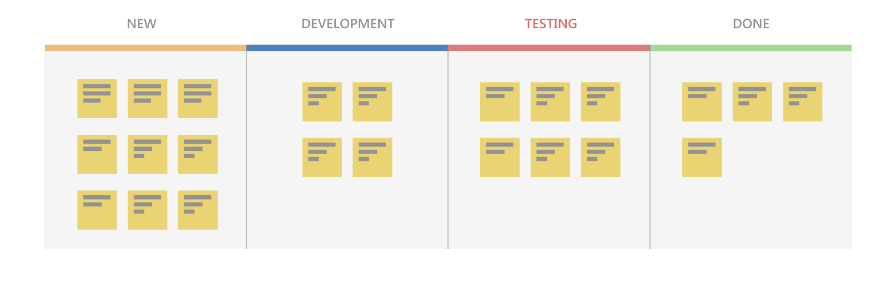

# What is Kanban

> By: Anthony Borton

Kanban is a Japanese term meaning signboard or billboard. An industrial engineer named Taiichi Ohno is credited with having developed Kanban at Toyota Motor Corporation to improve manufacturing efficiency

## Kanban for software development teams

While Kanban was created to help with manufacturing, software development teams share many of the same goals, including wanting to increase their flow and throughput. Using some of the guiding principles of Kanban listed below, teams can often improve their efficiency and deliver value to their users faster.

In this article, we’ll focus on Kanban as it applies to software development teams.

## Key Kanban principles

### Pull-model

Software development teams historically have had work pushed on them as stakeholders request more functionality. This is often accompanied by tight deadlines. A common side effect of this behaviour is that quality suffers as the team is forced to take shortcuts necessary to deliver the functionality within the timeframe.

Kanban helps a team focus on maintaining an agreed upon level of quality that must be met before the team can claim a piece of work as done. Stakeholders add requests to a backlog and then the team “pulls” work into their workflow as capacity becomes available.

### Visualize work

Understanding the status of a software development team in terms of both process and progress can be challenging. People can more easily understand the current state of work if it is shown using a visual representation rather than a large list of work items, or a document describing the work being done.

Visualization of work is a key Kanban principle. Kanban addresses this visualization using Kanban boards (discussed in more detail later in this article). Visualizing the work to be done as cards on a board, in different states, allows you to easily see the “big picture” of where the project currently stands, as well as identify potential bottlenecks that could affect productivity.

### Limit work in progress

Teams that try to work on too many things often suffer from reduced productivity due to frequent and costly context switching. The team is busy but work just doesn’t seem to be getting done resulting in unacceptably high lead times. To address this, limiting the number of backlog items a team is working on at any given time helps increase focus while reducing context switching.

The maximum number of items a team decides to work on at any point in time is known as the WIP limit. A well-disciplined team will work to ensure they are not exceeding their WIP limit. Should this occur, the team will investigate the reason, and work to solve the root cause for the issue.

### Continuous improvement

For software development teams to continuously improve, they need ways to measure their team’s effectiveness and throughput. Kanban, through the use of the Kanban board, provides a dynamic view of the state of work in a workflow. This allows the team to experiment with different processes and evaluate the impact on the flow of work more easily. Teams that practise Kanban often utilise measurements such as lead times and cycle times and generally embrace the benefits offered for continuous improvement.

## Kanban boards

A Kanban board is just one of many tools you can use to implement Kanban practises in a team. A Kanban board can be a physical board or a software application that shows cards arranged into columns. Typical column names may include To-do, Doing and Done but teams can customize this to suit the states in their workflow. For example; New, Development, Testing, UAT, Done.

Software based Kanban boards can display cards corresponding to Product Backlog Items and include links to things such as tasks and test cases. The following screenshot shows an example of a software-based Kanban board.

On a Kanban board, a WIP limit is applied to all “in-progress” columns. The first and last columns on a Kanban board do not have WIP limits. In Figure 3, assuming the WIP limit is 5, the testing column is exceeding the limit as illustrated by the bold column title and the change in color to red. This indicates that there may be a bottleneck in testing that is impeding the team’s flow. Once identified, the team can determine an appropriate course of action to remove the bottleneck.

## Cumulative flow diagrams

A common addition to software-based Kanban boards is a chart called a Cumulative Flow Diagram (CFD). This chart illustrates the number of items in each state over time, typically multiple months. The horizontal axis shows the timeline while the vertical axis shows the number of Product Backlog Items. Colors are used to indicate the state (or column) the cards are currently in.

This chart is particularly useful for identifying trends over time including bottlenecks and other disruptions to a teams’ velocity. An example of a good CFD would show a consistent upward trend while the team is working on the project. The various “stripes” across the top of the chart area should be roughly parallel if the team is working within their WIP limits.

Should one or more of the stripes show a bulge, this is usually a clear indicator of a bottleneck or impediment in the team’s flow. In the CFD shown below, you can see completed work (green) is flat while the previous state, Testing, is growing which indicates a probable bottleneck.

## Agile, Scrum and Kanban

While broadly fitting under the umbrella of [Agile](what-is-agile.md), both [Scrum](what-is-scrum.md) and Kanban are quite different. A few of the most notable differentiators include; scrum focuses on fixed length sprints where Kanban is more of a continuous flow model; Scrum has defined roles where Kanban does not define any specific roles for the team; and Scrum uses velocity as a key metric where Kanban champions the use of cycle time.

In calling out the differences in the previous paragraph, it is also common for teams to adopt aspects of both Scrum and Kanban to help them work most effectively. Remember, regardless of which characteristics you choose, you can always review and adapt until you get the best fit for your team. Start simple and don’t lose sight of the most important thing – delivering value regularly to your users!

 Get started with free agile tools with [Azure DevOps](https://dev.azure.com).

|                                                     |                                                                                                                                                                                                                                                                                                             |
| --------------------------------------------------- | ----------------------------------------------------------------------------------------------------------------------------------------------------------------------------------------------------------------------------------------------------------------------------------------------------------- |
|  | Anthony Borton is a DevOps Architect on the Global DevOps Customer Advisory Team. He has many years’ experience helping organizations adopt and succeed using DevOps practises. He was Australia’s first Professional Scrum Developer Trainer and has been a Microsoft Certified Trainer for over 20 years. |
