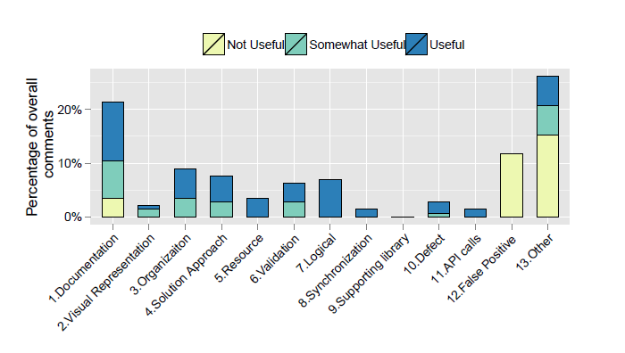

# Boosting your code reviews with useful comments
> By: Michaela Greiler

Having peer developers review code before changes are submitted and
integrated to the main codebase can be beneficial for a number of
reasons: First, code reviewing helps to improve software quality, as the
additional attention of peers can help to detect errors, improve
readability of the code, or even help with design decisions. Second,
code reviewing also helps to disseminate knowledge between team members
or even across different teams or organizations.

## Code reviewing takes time
Teams that are committed to code review are also quickly aware of its
main drawback: Code reviewing takes time – a lot of time. On average,
developers spend about six hours per week preparing code for review or
reviewing others’ code. Therefore, increasing the effectiveness of code
review practices is beneficial for ensuring developers’ time is spent
wisely. Here is what we found out during a large-scale study at
Microsoft \[1\].

## Code reviewing stands and falls with its comments
The main building blocks of code reviews are comments that reviewers add
as feedback and suggestions for change that the code review author can
address. The usefulness of those comments highly influence the
effectiveness of the code review practices.

## Teams want to track and boost their code review effectiveness
We have observed that teams using code review want to track and boost
the effectiveness of code review feedback. As one team manager
indicated:

“\[I like to know\] was this an impactful review, a useful comment on
the review? You know, not just a comment, but did it result in a change
that wouldn’t have been there before.”

## What are useful code review comments?
As the primary goal of code review is to ensure that a change is free
from defects, follows team conventions, solves a problem in a reasonable
way, and is of high quality \[2\], we consider review feedback useful if
it is judged useful by the author of the change to enable him or her to
meet these goals.

Through a series of interviews with developers, we discovered the
following three comment categories:

### Useful comments

- Identification of any functional issues. However, most of the review comments are unrelated to any types of functional defects.
- Pointing out missing validation checks or alternate scenarios (including corner cases) where the current implementation may fail.
- Suggestions regarding APIs to use, designs to follow, coding patterns, team coding conventions or best practices.

### Somewhat Useful comments

- “nit-picking issues” (e.g., indentation, comments, style, identifier naming, and typos). Resolution of nit-picking issues helps long-term
    project maintenance.
- Feedback / questions to help authors to think about an alternate implementation or a way to refactor the code to make it more comprehensible (even if the current implementation may be correct).

### Not Useful comments

- Asking questions merely to understand the implementation. Those comments may be useful to the reviewers, but are not considered useful by the author as they do not improve the code.
- Praising code segments. Those comments may help building positive impressions between the team members, and encourage good coding, but interviewees rated those as ‘Not useful’.
- Pointing out future work, not planned for the current development cycle, or comments about code that was not related to the change at all, but simply existed in the changed files.

## Reviewers should talk about defects and maintainability of the code
To understand which issues are raised and how useful those are during code reviewing, we had developers classify review comments, see Figure 1. In general, interviewees rated almost 69% comments as either useful
or somewhat useful. Most of the comments identifying functional defects
were rated as “Useful” (categories from 5 to 11 in Figure 1). More than
60% of the “Somewhat Useful” comments belong to documentation in the
code, visual representation of the code (e.g. blank lines, indentation),
organization of the code (e.g. how functionality is divided into
methods), and solution approach. These four all belong to so called
“evolvability defects”, i.e., issues that affect future development
effort rather runtime behavior \[3\].

  
> Figure 1: Utility of specific comment categories

## Reviewers with relevant experience improve the value
There are several factors that should be considered to increase the
usefulness of the feedback:

### Add reviewers with experience about that piece of code
Reviewers who have either changed or reviewed an artifact before give
more useful comments than reviewers unexperienced with that piece of
code. Interestingly, to be able to give more useful comments, it is
enough to have changed that code once, i.e., developers who had changed
a file ten times had the same usefulness density as developers how had
only changed a file once. If developers have not edited that piece of
code, it takes them about five reviews to get to their full potential.

### Add senior reviewers
Reviewers that have spent more time in the organization contribute a
higher density of useful comments. The effect is especially visible for
new hires, who in the first three months had the lowest density of
useful comments. During the first year, the usefulness density increases
the most, and stays relatively stable afterwards. At Microsoft, the
first year is often considered “ramp up” time for the new hires. During
that time employees become more familiar with the code review process,
project design, and coding practices at Microsoft. After the ramp up
period, they can be as useful reviewers as their senior Microsoft peers.

### Outsiders might help you think out of the box
Although most comments come from team members, cross-team reviewers are
often picked because of their expertise in a specific area. Reviewers
from different teams give slightly more useful comments than reviewers
from the same team. This outside perspective helps to spot issues the
team did not focus on.

### Submit changes for review in small batches
As the number of files affected by the change increases, the density of
useful comments drops. Reviewing larger changes is more complicated,
takes more time and effort, and is often less thoroughly done. Ideally,
reviews should contain small, incremental and complete changesets.

### Pay additional attention to non-code files
It is harder for reviewers to give useful comments on non-code files.
Especially configuration and build files have a low proportion of useful
comments. We expect that this may be due to the complexity of those
files.

## Want more details?
For more information on this subject please have a look at the related
[technical report](https://www.microsoft.com/research/wp-content/uploads/2016/02/bosu2015useful.pdf).

## References
\[1\] A. Bosu, M. Greiler and C. Bird, “Characteristics of useful code
reviews: an empirical study at Microsoft”, Proceedings of the 12th
Working Conference on Mining Software Repositories, pp. 146-156  
Url:
\[2\] A. Bacchelli and C. Bird, “Expectations, outcomes, and challenges
of modern code review,” in Proceedings of the 2013 International
Conference on Software Engineering. IEEE Press, 2013, pp. 712–721.
\[3\] M. Mantyla and C. Lassenius, “What types of defects are really
discovered in code reviews?” Software Engineering, IEEE Transactions on,
vol. 35, no. 3, pp. 430–448, May 2009.

|             |                           |
|-------------|---------------------------|
||Michaela works as a software engineer and researcher at Microsoft. She supports product teams including Office, Windows, Exchange to optimize their software development processes. She especially focuses on optimizing effectiveness of company-wide testing and code reviewing activities. |