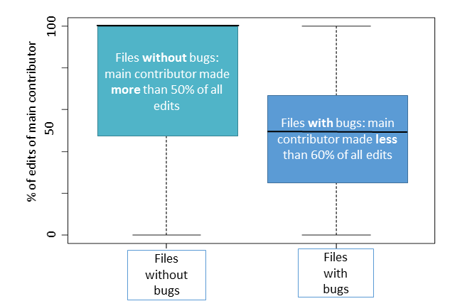

# Code ownership and software quality
> By: Michaela Greiler

Collective code ownership has been advocated as a best practice \[1\].
Is it always?

Several studies have shown that code ownership has an impact on software
quality. This article outlines code ownership and its impact on quality
and shows the results of two studies we performed at Microsoft
investigating this topic.

## What is code ownership?
In a traditional sense, ownership determines rights and duties in regard
to an object, for example a property. The owner of source code usually
refers to the person who implemented the code. However, larger code
artifacts, such as files, are usually composed by multiple engineers
contributing to the entity over time through a series of changes.
Frequently, the person with the highest contribution, in terms of lines
written or code changes made, is defined as the code owner and takes
responsibility for it. The owner is thus the engineer who has the most
hands-on experience with the code.

## How can you measure code ownership?
There are many ways in which we can measure ownership, especially for
source code. In our particular case, we were interested in **reflecting
the notion of responsibility**—how many engineers are currently
contributing to the code and whether there is a single individual who
can be considered the primary contributor.

### Determine ownership by counting commits.
We base our ownership metrics on tracing changes as they are committed
to source code repositories. For simplicity, we **treat each commit to
the affected artifact (source file or an executable) as one
event**—irrespective of how many line of code changed.

### Distinguish strongly and weakly owned artifacts
We call the artifact **strongly owned** in a time period when at least
50% of its edits where contributed by a single developer (irrespective
of the total number of developers modifying the artifact). Conversely,
**weakly owned** files have no such primary developer.

### Hypothesis: Code ownership affects code quality
Weak ownership means distributing the responsibility for a particular
part of software among multiple developers. We speculated that code
without a primary owner might have no champion who will take
responsibility to maintain and test the code. Without such code owners,
knowledge about the inner working and functionality of code might be
limited and once lost completely, it might take time to recover.
Overtime, such files become more susceptible to bugs.

## Studying the consequence of weak code ownership
At Microsoft, we conducted two studies to investigate the phenomena of
weak ownership. In a first study, we showed that Windows executables
that lacked clear code ownership were more likely to be defect prone
than strongly owned Windows executables, for both Windows Vista and
Windows 7 \[2\]. While the results of this study are convincing, the
chosen level of the study (executables) is too coarse to be actionable
in practice. For example, a weakly owned executable can be composed of
hundreds of source files each owned by a single engineer.

### Looking into granular code ownership by file
To make the results more actionable for engineers, we decided to extend
the original investigation and to look at two different granularity
levels \[3\]: source files and directories. We choose directories as
they are logical groupings of files that often share common properties,
and often contain files which are close together in terms of
functionality or product architecture. We also widened the scope of our
investigation to other Microsoft products, which include Office,
Windows, Office365 and Exchange.

## Validation: Strong ownership matters
In this follow up study, we also demonstrated a strong relationship
between ownership and quality. For example, we could show that the more
engineers modify a file, the higher the number of bugs that are linked
to this file and that if there is **one primary contributor, the chances
for a file to be buggy decreases significantly** (see Figure 1).

### Predicting bugs based on weak ownership
In addition, ownership metrics have a strong defect prediction power. We
show that the **number of contributors and the percentage of edits of
the least involved contributor effectively identify future buggy code
files and code directories**.

## Weak ownership is not always intentional
In follow up discussions with the development teams, it became clear
some of the files were being changed by more people than the team
assumed. For other artifacts though, engineers were well aware of the
many contributors and the weak ownership was architecturally intended.
This doesn’t change the fact that these edits were more likely to cause
issues in software.

### One size does not fit all cases of code ownership
Simply enforcing a very strong ownership model might not be the right
solution, as ownership not only has implications on responsibility and
accountability, but also on knowledge and dependencies. If we restrict
ownership to one engineer per file or directory, we limit the number of
engineers who are knowledgeable about that piece of code. Not being
familiar with a certain piece of code is a serious problem and building
a mental model about software a tedious task \[4\]. Also it has been
shown that it is hard for developers to understand the code of others,
and that “developers go to great lengths to create and maintain rich
mental models of code that are rarely permanently recorded.” This
directly impacts the ability of a developer to contribute to source code
that she has not edited before. Nevertheless, weak files, intended or
unintended can be a threat to the quality of a software system and
actions should be taken to tackle the problem.

## What should you do with weakly owned code?

### Distinguish collaborative ownership from non-ownership
**Identify your weakly owned files and directories** to understand the
mechanisms and dynamics at play. Are they intended to be changed by many
developers? Are they positioned well architecturally? Martin Nordberg
\[5\] in his paper makes a difference between “collaborative” ownership
and “non-ownership”.

> **Collaborative ownership**. Nordberg defines collaborative ownership,
> as an ownership where code is collectively owned, but responsibilities
> and schedules are clear. Each team member can work across subsystems
> or services as needed. If implemented right, this style helps to build
> and maintain knowledge about the code among team members and one might
> expect the quality of such systems to be high.
> 
> **Non-ownership**. On the other hand, non-ownership is a situation in
> which several developers make changes to the same subsystem but with
> minimal coordination or accountability for quality or team
> communication. In such systems, one might expect the quality to be
> low. In our discussions with engineers they alluded to a similar kind
> of differentiation. Engineers are obviously worried about the
> unintended or unknown weakly owned artifacts which seem to correspond
> to the non-ownership category, and expressed the need to further
> investigate.

### Assign code ownership
As much as possible assign an **owner to currently weakly owned files**
and directories or clarify responsibilities.

### Use code ownership to ensure awareness and guide refactoring
We recommend that teams pay attention to ownership of files and
directories, and especially to those where the reason for a lack of
strong ownership is unclear. Assigning an owner might not imply that
this is the only person that is allowed to change the artifact, but that
this person is aware of changes to the artifact for example via code
reviewing practices. If the reason for the weak ownership are
architectural, the team should consider refactoring to split weakly
owned files into more coherent
units.

### If you can’t simplify ownership, apply code reviews and tests to minimize risk
If driving changes to the ownership model is not possible or desired,
**use ownership information as indicator of risk**. For artifacts, where
strong ownership is not possible in practice, we highly recommend that
changes to such weakly owned files and directories are carefully
reviewed. We recommend to use ownership information to drive test and
code review efforts.

## References
\[1\] K. Beck, Extreme Programming Explained: Embrace Change 2nd. ed.,
Boston: Addison-Wesley, 2000.

\[2\] C. Bird, N. Nagappan, B. Murphy, H. Gall and P. Devanbu, “Don’T
Touch My Code\!: Examining the Effects of Ownership on Software
Quality,” in Proceedings of the 19th ACM SIGSOFT Symposium and the
13th European Conference on Foundations of Software Engineering, 2011.

\[3\] M. Greiler, K. Herzig and J. Czerwonka, “Code ownership and
software quality: a replication study,” in Proceedings of the 12th
Working Conference on Mining Software Repositories, Florence, Italy,
2015.

\[4\] T. D. LaToza, G. Venolia and R. DeLine, “Maintaining mental
models: a study of developer work habits,” in International Conference
on Software engineering , New York, 2006.

\[5\] M. E. Nordberg III, “Managing Code Ownership,” IEEE Softw., pp.
26-33 , 2003.

\[6\] J. Czerwonka, N. Nagappa, W. Schulte and B. Murphy, “CODEMINE:
Building a Software Development Data Analytics Platform for Microsoft,”
IEEE Software, pp. 64-71, 2013.

\[7\] M. Foucault, J.-R. Falleri and X. Blanc, “Code ownership in
open-source software,” in Proceedings of the 18th International
Conference on Evaluation and Assessment in Software Engineering, New
York, 2014.

\[8\] C. Bird, N. Nagappan, P. Devanbu, H. Gall and B. Murphy, “Does
Distributed Development Affect Software Quality? An Empirical Case Study
of Windows Vista,” in Proceedings of the 31st International Conference
on Software Engineering, 2009.

\[9\] N. Nagappan, B. Murphy and V. Basili, “The Influence of
Organizational Structure on Software Quality: An Empirical Case Study,”
in Proceedings of the 30th International Conference on Software
Engineering, 2008.

\[10\] K. Herzig and N. Nagappan, “The Impact of Test Ownership and Team
Structure on the Reliability and Effectiveness of Quality Test Runs,” in
Proceedings of the 8th ACM/IEEE International Symposium on Empirical
Software Engineering and Measurement, 2014.

\[11\] F. Rahman and P. Devanbu, “Ownership, Experience and Defects: A
Fine-grained Study of Authorship,” in Proceedings of the 33rd
International Conference on Software Engineering, 2011.

\[12\] A. Meneely and L. Williams, “Secure Open Source Collaboration: An
Empirical Study of Linus’ Law,” in Proceedings of the 16th ACM
Conference on Computer and Communications Security, 2009.

\[13\] A. Mockus, “Succession: Measuring transfer of code and developer
productivity,” in Proceedings of the 31st International Conference on
Software Engineering, Vancouver, 2009.

|             |                           |
|-------------|---------------------------|
||Michaela works as a software engineer and researcher at Microsoft. She supports product teams including Office, Windows, Exchange to optimize their software development processes. She especially focuses on optimizing effectiveness of company-wide testing and code reviewing activities. |