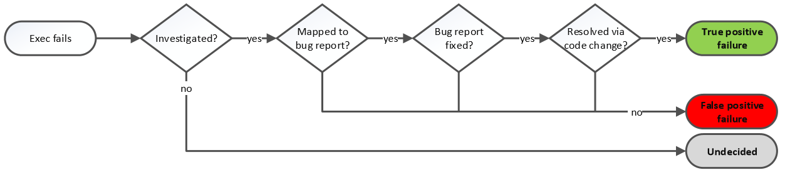

# Getting the noise out of test runs
> By: Kim Herzig

Can you believe your test results? If a test runs green or red, is it a
true pass or fail, or might it be a false positive or negative? Sorting
out the noise of false alarms from correct test results is a nasty
manual exercise and insidious waste of time. This experience report
looks at a method to distinguish reliable from noisy test results.\*

## Testing code changes
Every day engineers change software systems by applying code changes to
add new features, improve the product, or to fix known issues. However,
their code changes increase the risk of introducing new issues or
incompatibilities. To ensure that code changes do not lower product
quality, developers typically test their code changes before merging
them into the main code base.

## It takes time to run tests
Testing all code changes applied to a code base for large software
systems may be a time-consuming task. While test cases on unit level
might run fast, higher-level tests, such as system and integration
tests, usually take more time to complete. Thus, the more changes are
applied the more tests need to be executed and the more time each code
change spends in verification before being integrated into the final
product. Testing processes tend to reduce code integration speed (code
velocity) and slow down product development. Therefore, optimizing test
processes is likely to positively affect speed and productivity of
overall software development processes.

## False test alarms
In theory, test cases either pass or fail, and if they fail, there may
be code defects. In practice, running system and integrations tests (for
example, Microsoft Windows or the Microsoft Dynamics business software
suite) require complex test setups and infrastructures, which come with
their own issues. Thus, system and integration tests may also fail due
to test and infrastructure issues, for example, broken hardware prevents
a test from retrieving a remote file. We call such test failures false
test alarms.

## The waste of manual investigation
As any test failure, false test alarms are reported to the engineers and
require manual investigation, lowering development speed. However, false
test alarms provide no insights into product quality but only harm the
development process. Therefore, it is desirable to minimize or eliminate
false test alarms, or at least, prevent them from disrupting the
development process.

## True test failures matter
At the same time, tests that fail due to code defects must remain
enabled. These failures must be investigated because actual code defects
may ship to customers.

The goal of this work is to develop a precise false test alarm
classification model, which identifies false test alarms automatically.

## Automatic classification of flaky tests
Our model analyzes reported and manually classified false test alarms.
The Figure below illustrates a simple flow chart of how this is used in
practice:

## Hypothesis: True failures lead to action
Using association rule mining, we detect frequently occurring patterns
of individual test step failures that are unique for false test alarms.
These mined association rules are then used to automatically classify
newly reported test failures as false test alarms.

## Distinguishing false alarms in practice
We evaluated our approach on a large set of false test alarms that were
reported by system and integration test cases during development periods
of Windows and Dynamics. We evaluated our classification model on two
development processes and periods covering the development of Microsoft
Windows and a 2-year development period of Microsoft Dynamics. Our
classification model shows a mean precision above 0.85 for both
products. This means that our classification model produces a false
positive rate below 15%. Recall values for both products are low and
range between 0.3 and 0.5.

## Prune flaky tests rather than waste time on them
The model is an excellent tool to help engineers to prioritize test
failures and to provide additional input for engineers to confirm the
classification model’s decisions. Such a scenario has two important
benefits:

1.  The model would reduce the risk to a minimum of code defects being
    wrongly classified as false alarms. Instead of suppressing the test
    failure, the failure still reaches engineers but warns them about
    the possibility of being a false test alarm. This workflow allows
    for human supervision of the classification system and may include a
    feedback loop that allows engineers to override classification
    results, in turn training the classification model further.
2.  At the same time, such an interactive model might help engineers
    prioritize their test failure inspection to focus on the failures
    most likely to matter.

The end goal is to be able to trust test results without having to waste
time on inspection. Using a predictive model demonstrably improves the
efficiency.

## References:
\* Kim Herzig, Nachiappan Nagappan: Empirically Detecting False Test
Alarms Using Association Rules. ICSE (2) 2015: 39-48

|             |                           |
|-------------|---------------------------|
||Kim leads the analytical team on the Tools for Software Engineers team. The focuses lies on helping development teams to speed up their development process(es) while maintaining or increasing product quality and reliability. |