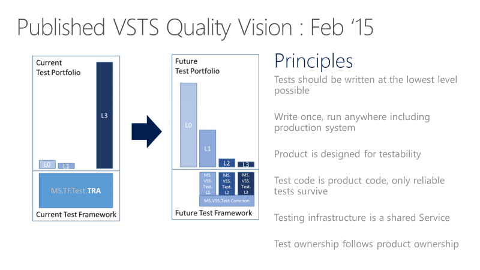
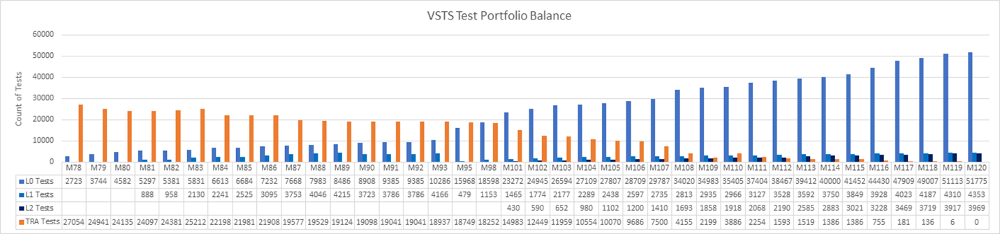

# Shift Left to Make Testing Fast and Reliable
> By: Munil Shah

## How We Once Worked
Back in September 2014, we were three years into our cloud cadence. And
we were still running our testing the way we had tested before moving to
the cloud. We were trying to do things faster, we were trying to
optimize our automation, but we were
struggling.

> [!VIDEO https://www.youtube.com/embed/iJkI8PwlxR4]

## Tests Took Too Long and Failed Frequently
Our tests took too long. We had a test suite called NAR, which stands
for Nightly Automation Run. That took 22 hours. And it’s interesting we
had a test suite called “Nightly Automation Run”. By definition we were
telling engineers to create tests that took all night to run\! And we
had another test suite called FAR, Full Automation Run, and that took
two days to run. In retrospect it looks absurd that we would name test
suites that way, but that’s what we had.

Test failed frequently. We could never get a run that passed without
significant number of failures. Sifting through the failures was so
time-consuming that teams mostly ignored the failures until we reached
end of sprint. In retrospect we probably never had a full test run of
the product that achieved 100% pass rate on the first go.

We focused on driving reliability of our P0 run – about a few dozen
integration style tests. Getting those to pass consistently was a pain.
We would run them in a tight loop and count how often they passed 100%.
If they failed, we’d file a P0 bug and push the team to fix it. With
concerted efforts, we could only get them to pass 100% only about 70% of
the time. They would fail in variety of ways: infrastructure, product
issues, flakiness in the tests.

We couldn’t trust the quality signal coming out of the Master branch. An
engineer would commit code changes to master, then 12 hours later get
the first quality signal with a bunch of failures. It took a long time
to sift through those failures. So the team often ignored the failures
until we reached the end of the sprint. From there it was a huge cliff
to get to the release quality. Sometimes it took us three more weeks
just to get to that point.

## New Quality Vision
It became clear we needed a completely new approach. In Feb 2015 we came
out with the new VSTS Quality vision document.

The core part of the vision was turning he entire test portfolio on its
head. We drew this conceptual picture of what we wanted our test
portfolio to look like. The y-axis has no real numbers but was drawn to
scale to illustrate the point. L0, L1s are the unit tests and the L2,
L3s are the functional tests.

## Test Principles
We came out with a set of principles that the team would adhere to.
These are fairly self-explanatory.

1.  ### Tests should be written at the lowest level possible
    
    This is a way of saying that we will favor tests with the fewest
    external dependencies over all other types of tests. We want the
    majority of our tests in the future to run as part of the build.
    Think of a parallel build system that could run unit tests for an
    assembly as soon as that assembly and an associated test assembly
    drop. We clearly cannot test every aspect of a service at this level
    but the principle we need to keep in mind is that we should never
    choose to test something with a functional test (L2/L3) where a unit
    test (L0) could have given us the same information.
2.  ### Write once, run anywhere including production system
    
    A large number of the tests in our test portfolio then used server
    Object Model. There were many reasons for this including a lack of
    testability in the product. This is a practice that needed to end
    for a few different reasons. Tests written to the server OM depend
    on internal knowledge and are exposed to implementation details that
    often do not matter from a functional test perspective. It also pins
    the tests to environments where the secrets and configuration
    information necessary to run those tests is available. That
    generally excludes all of our functional tests from being run
    against production deployments. Another way of stating this
    principle is that functional tests (L2/L3) should only use the
    public API of the product.
3.  ### Product is designed for testability
    
    One of the key opportunities we have under the combined engineering
    model is to do a better job of taking a complete view of what it
    means to deliver a quality product on a cloud cadence. Shifting the
    balance strongly in favor of unit testing (L0) over functional
    testing (L2/L3) requires us to make design and implementation
    choices that support testability. There are different schools of
    thought about exactly what constitutes well-designed and
    well-implemented code from a testability perspective – just as there
    are different perspectives on coding style. The principle to keep
    clearly in mind is that design for testability must become a first
    class part of the discussion about design and code quality
    throughout the team.
4.  ### Test code is product code, only reliable tests survive
    
    This speaks to the mindset that we treat test code just the same way
    we treat our product code. We sometimes say “config is code” to
    express the importance of having sound engineering practices in
    place to manage configuration data. Explicitly stating the principle
    that test code is product code is a way of saying that the quality
    level of this body of code is as important to shipping as our
    product code. We must apply the same level of care in the design and
    implementation of tests and our test frameworks. A code review that
    does not consider the test code or hold it to the same quality bar
    is not complete.
    
    An unreliable test is an organizationally expensive thing to
    maintain. It works directly against the engineering efficiency goal
    by making it hard to make changes with confidence. We want to land
    in a place where engineers can make changes anywhere and can quickly
    gain a high degree of confidence that nothing has been broken. We
    must maintain a very high bar for reliability. We will discourage
    the use of UI tests. Our experience is that UI tests are generally
    unreliable as a class.
5.  ### Testing infrastructure is a shared Service
    
    We must lower the bar for using our test infrastructure to generate
    quality signals we can trust. Unit test (L0) code should live
    alongside product code and should be built with the product. We
    ultimately want those tests to run as part of the build process.
    Those tests must also run under the Visual Studio Team Explorer.
    Testing is a shared service for the entire team. It’s very well
    supported. It will have the same reliability as the product code.
6.  ### Test ownership follows product ownership
    
    And the last point is that the test ownership follows product
    ownership. In other words, the test sits right next to the product
    code. If you have a component that is tested at that component
    boundary, you do not rely on somebody else to test your component.
    We push the accountability to the person who is writing the code.

## Shift-Left\!
This is another view of the quality vision seen through the pipeline. It
shows what it means to shift left and move quality upstream. Most of the
testing is completed even before a change is merged into the
master.

## Selling the Vision to the Team
The first issue we had to tackle was convincing the team to start
writing more unit tests. Before, the dedicated testers wrote most of the
tests. The unit test muscle wasn’t developed. But there was downright
skepticism about the strategy. Unit test war broke out. Can the product
be really tested this way? We had bad experience with unit tests before
– how is this different? Is management going to commit to this vision?
You can see the tug of war here where there are people who were
extremely skeptical, not only about the approach but also the management
commitment behind it. And then there were people who were passionate
about this new direction. We had rigorous debate about the type of unit
testing that would be allowed, the classical versus mockist approach, in
other words unit tests that are completely isolated versus unit tests
that take some amount of dependency.

For each of these questions, we took fairly pragmatic approach and
focused on getting the flywheel going. For example, we pushed for the
classical approach where it was possible to refactor the code or it was
new code. But when authoring unit tests for the legacy codebase we
allowed some dependency. Significant portions of our product code uses
SQL and we allowed unit tests to take dependency on the SQL resource
provider instead of mocking that layer.

## Test Taxonomy
We needed new taxonomy. Previous taxonomy was based on duration of the
tests, nightly run (NAR), full automation run (FAR), etc. We created new
taxonomy that was based on the measure of external dependencies. We
roughly divided tests into two categories.

### L0/L1 – Unit tests
L0 – Broad class of fast in-memory unit tests. An L0 test is a unit test
to most people. That is a test that depends on code in the assembly
under test and nothing else.  

L1 – A L1 test might require the assembly plus SQL or the file system.

### L2/L3 – Functional tests
L2 – Functional tests run against “testable” service deployment. It is a
functional test category that requires a service deployment but may have
key service dependencies stubbed out in some way.  

L3 – This is a restricted class of integration tests that run against
production. They require a full product deployment.

## Unit Test Characteristics
We have strict guidelines for L0 and L1 unit test. These tests need to
be very fast and reliable. Average execution time per L0 test in an
assembly is less than 60 milliseconds. Average execution time per L1
test in an assembly is less than 400 milliseconds and no test can exceed
2 seconds. At present, we can run over 60,000 unit tests in parallel in
less than 6 minutes and our goal is to get this down to less than a
minute. We track unit test execution time using charts like below and
file bugs against tests that exceed the allowed thresholds.

## Functional Tests Must Be Independent
The key concept for the L2s is test isolation. Properly isolated tests
can be run in any sequence. You can run a properly isolated test in any
sequence reliably because it has a complete control over the environment
it is being run on. You must have a well-known state at the beginning of
the test. If one test creates some data in the database and leaves it
lying around, it can corrupt the run of another test which may rely on a
different database state.

In our old functional tests, if a test needed a user identity, it would
call external authentication providers to get an identity. There are a
couple of challenges with this. First, there is an external dependency
that could be flaky or unavailable momentarily, which can break the
test. It violates that test isolation principle because state of that
identity (e.g. permission) could be changed by a test, but the next test
could expect a different state and fails.

To circumvent that we built fake identity support in the core test
framework. It was built aligned to the product using extensibility of
the core platform. The L2 tests can take advantage of these identities
and run the tests in complete isolation. We have been very careful in
deciding where we use fakes in the product.

## Set a North Star and Measure Progress Sprintly
The graph below shows our progress, in triweekly sprints. The graph
covers sprints 78 – 120. This is 42 sprints or 126 weeks, about two and
half years’ worth of effort.

We started at 27K legacy tests (in orange) in sprint 78. The legacy
tests are at 0 at S120. Most of old functional tests are replaced with a
set of unit tests (L0/L1s). Some are replaced with the new L2 tests. And
many are simply deleted. Mission accomplished\! The new test portfolio
looks even better than the one we set out to do with the picture shown
earlier.

Let’s talk about how we made this journey. We left the old functional
tests (“TRA tests”) alone when we started. First we wanted to get the
team to buy into the idea of writing unit tests, particularly for the
new features. We wanted to get the flywheel going. We made it super easy
to author the L0 and L1 tests. We wanted to build that muscle first. The
graph shows unit test count starting to build up early on. The team
started to see the benefit of authoring unit tests. These tests were
easier to maintain, they are faster to run, and they had fewer failures. We started running all unit tests in the pull request flow.

We did not focus on writing new L2 tests until sprint 101. In the
meantime, the TRA test count went down from 27,000 to 14,000 from Sprint
78 to Sprint 101. Some of the TRA tests were replaced by the new unit
tests, but many were simply deleted based on team’s analysis of their
usefulness. Notice how the TRA tests jumped from 2100 to 3800 in sprint
110. No, we did not write new TRA tests. We simply discovered more of
them in the source tree and added them to this graph\! We were running
the tests but weren’t tracking them properly.

Overall, this effort to completely redo our test system over the past
2+years has been a massive investment. Every single sprint, many feature
teams across the org invested time in this. In some sprints it was most
of what a feature team did. Not every team did the work at the same
time. We don’t know the total cost of doing this was, but we couldn’t go
where we are trying to go with the business without doing it. So in the
long term it was worth it.

## Getting Fast
The key takeaway here is that once you have a Continuous Integration
signal that is extremely fast and reliable, you can trust your CI
signal. The picture below shows our PR and CI pipeline in action and the
time it takes to go through various phases. Pull Request to Merge takes
about 30 minutes. We run about 60,000 unit tests in the Pull Request.
From code merge to CI build is about 22 minutes. The first quality
signal from CI (SelfTest) is about an hour. By that time most of the
product is tested with that change. Within 2 hours (Merge to SelfHost),
the entire product is tested and the change is ready to go into
production.

## DevOps Metrics We Use
This is what our team scorecard looks like. At a high level, we track
two types of metrics: Live site and engineering health (or debt), and
engineering velocity.

In case of live site, we are interested in our time to detect, time to
mitigate, and how many repair items a team is carrying. A repair item is
the work the team identifies as part of live site retrospective to
prevent similar class of incidents from happening again. We track that
the teams are closing those repair items within a reasonable amount of
time.

For engineering health, we cap active bugs per engineer. If a team has
more than 5 bugs per engineer, they need to prioritize fixing those bugs
ahead of new feature development. We also track aging bugs in special
categories like security.

For engineering velocity, we measure speed in different parts of the
CI/CD pipeline, with the overall goal of increasing the velocity of
starting from an idea to getting the code out into production and
getting data back from the customers.

|             |                           |
|-------------|---------------------------|
||As Partner Director of Engineering in Microsoft's Cloud and Enterprise division, Munil Shah leads engineering for Visual Studio Team Services and TFS products. Munil has over 20 years of experience building large scale software and distributed services. Prior to his current role, he held various engineering leadership positions Bing Advertising and Windows groups at Microsoft. He is passionate about leading engineering teams through significant transformation to deliver successful solutions to customers. |