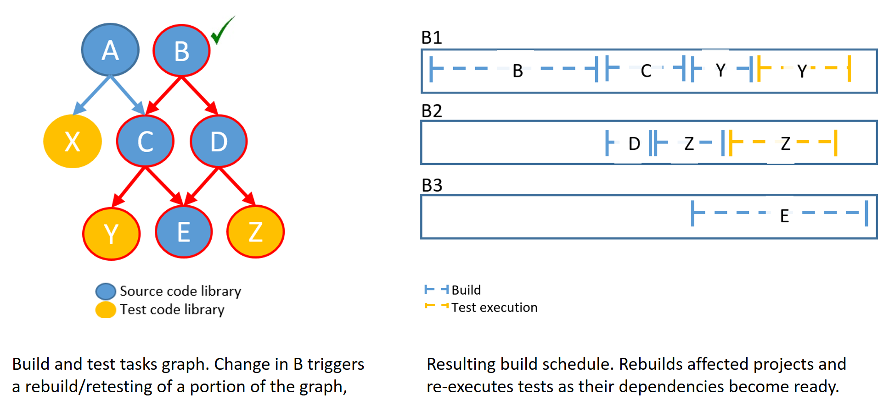

# Test while building to maximize test effectiveness and minimize cost
> By: Jacek Czerwonka

Unit testing is a commonly used practice for early detection of defects
in software. One of its applications is regression testing, which
ensures that software changes do not break any of the previously working
functionality.

## Mapping tests to code is believed to reduce cost
Although the main benefits of regression testing in managing risk of
software releases are well known, one of the common issues is the cost
of executing regression tests. In recent academic studies \[1, 2, 3\],
regression testing is found to take up to 80% of the testing budget.
Many ways were proposed to tackle this problem; just look up “regression
test selection” in literature. The way these methods typically work is
that they attempt to establish a mapping between product code and test
cases, and when the product changes, the mapping identifies affected
tests. Although you can find many types of test selection techniques
\[4\], they are not widely adopted in practice due to a significant
overhead in terms of collecting and maintaining dependency information.

## Mapping software to its tests – the old way
In the simplest case, teams define and maintain the mapping manually.
Even if initially accurate (unlikely), it quickly becomes a maintenance
headache on its own. Some level of systematic data collection is needed
to keep the map up to date. Collecting code coverage information is one
such mechanism. It comes with many benefits: it typically is collected
at a level that enables fine granularity of the mapping (for example,
the method to test or even a statement to test). But coverage is also
expensive to collect regularly and is always a bit behind, because
collecting coverage depends on running tests.

## Use the build to find the right set of unit tests
We experimented with another approach. One that assumes that the mapping
should be a by-product of software construction so it is always up to
date and available. Once available, the system executes only a subset of
unit tests impacted by a change with no additional overhead beyond what
is required by the underlying build system.

## Fitting a DevOps Delivery Cadence
Microsoft has rapidly adopted agile software engineering methodology to
enable a delivery cadence of days or weeks. For instance, Office 365,
Azure DevOps, and SQL Azure have release cycles measured
in weeks. Others might even release several times daily.

## Enter CloudBuild for fast feedback
Thousands of Microsoft engineers build and test hundreds of software
products many times a day. It is essential that this continuous
integration scales, guarantees short feedback cycles, and functions
reliably with minimal human intervention. Our cloud-based build system
(appropriately called CloudBuild) is responsible for all aspects of a
continuous integration workflow, including builds, tests, code analysis,
deliverying build outputs, and creating and storing packages. CloudBuild
uses content-based caching to run tasks only when needed. Also,
CloudBuild uses many machines in parallel.

## Mapping software to its tests – now by construction
When your build, testing, and program analysis pipeline is distributed,
the pipeline provides fast, reliable, resource-effective, and convenient
builds through incremental, cached, and scaled-out computations. In
particular, CloudBuild does static parsing of build metadata in the
source code and generates a dependency graph for all projects. Next,
CloudBuild builds only those projects that are impacted by a given code
change. Therefore, if a test project is not built fresh by CloudBuild,
it is not going to be executed. The effect is that CloudBuild performs
regression test selection as a side-effect of its regular function.

## Testing earlier, while building
Traditionally, tests are executed only after the entire build is
completed. In contrast, CloudBuild executes tests immediately after the
referenced projects are compiled, rather than waiting for the entire
build to finish. Since builds and tests are automatically distributed
across multiple machines in data centers, CloudBuild efficiently
executes tests without adding any substantial overhead to the overall
build time. In this way, tens of millions of tests, contributed by
thousands of Microsoft engineers, are automatically run every day.

## Only good tests apply
The goal is to provide fast, reliable, and isolated test executions.
Since builders in data centers are shared across projects, it is
important to ensure that test executions of one do not pollute the state
of another (or the build nodes themselves). Only tests that meet the
“5S” criteria are allowed to run as part of the build. The tests
should be:

  - Significant – you’re willing to break the build when they fail.
  - Short – they execute in seconds. Tests whose duration is too
    variable or sensitive to timing are not good candidates.
  - Simple – they run on a single node and do not require complex
    topologies.
  - Standalone – they bring all required dependencies and data with
    them, so that they don’t require set up.
  - (Without) Side-effects – they do not change system-wide state
    before, during, or after they run.

## Enforcing test quality
To ensure no content is authored that breaks the above rules, we have to
very powerful enforcement mechanisms: (1) any test break is also a build
break; no exceptions, (2) tests execute inside a sandbox that imposes
isolation and timing rules on execution.

By adhering to these principles, CloudBuild infrastructure provides
enough rigor to allow tests to run as part of a build in a data center
and not pollute the environment while still providing engineers enough
functionality out of the box. And, as a bonus, we run only those tests
that are affected by changes.

## References
\[1\] E. Engstrom and P. Runeson. A qualitative survey of regression
testing practices. In Product-Focused Software Process Improvement,
volume 6156, pages 3-16. Springer-Verlag, 2010

\[2\] H. K. N. Leung and L. White. Insights into regression testing. In
International Conference on Software Maintenance, pages 60-69, 1989.

\[3\] P. K. Chittimalli and M. J. Harrold. Re-computing coverage
information to assist regression testing. In International Conference on
Software Maintenance, pages 164-173, 2007.

\[4\] S. Yoo and M. Harman. Regression testing minimization, selection
and prioritization: A survey. Journal of Software Testing, Verification
and Reliability, 22(2):67-120, 2012.

|             |                           |
|-------------|---------------------------|
| |Jacek is a lead developer on the Tools for Software Engineers team focusing creating solutions for understanding software engineering organizations, and improving engineering processes at Microsoft. His team works on engineering data analytics platform CodeMine and code review experiences and tools. |