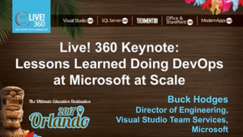
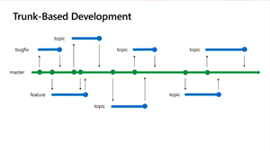

# DevOps Events and Talks

## Highlights 

|DevOps at Scale|Agile at Microsoft|Git (Anti-) Patterns|
|----------------|------------|------------|
||||

---

## Presentations

Selected videos from both public conferences and internal training sessions.

| TITLE| DESCRIPTION | PRESENTERS  | LENGTH | DATE |
|:-----|:------------|:------------|--------|------|
|[Global DevOps Bootcamp 2018 Keynote](https://www.youtube.com/watch?v=aIiLhK0NIlY)|In this video, Buck Hodges gives a 30 minute overview of how we evolved from TFS into VSTS as a service that ships every sprint.|Buck Hodges | 26 |June 2018 |
|[Azure DevOps with VSTS](https://www.youtube.com/watch?v=P72xfZLkFJ0)|DevOps is about people, process and products. Getting it all right requires effort but the benefits to your organization and customers can be huge. Microsoft has a fantastic set of products that can adapt to any language on any platform. In this demo heavy session, starting from just a blank desktop, we will create a new DevOps project and a complete pipeline. We will show you how to deploy to a number of different Azure services, all live and hands on.|Damian Brady, Abel Wang| 59 |May 2018|
|[Git patterns and anti-patterns for successful developers](https://www.youtube.com/watch?v=ykZbBD-CmP8)|In this session we show how to use Git in teams with pull requests and how to use branches to manage your releases. In this session we will compare GitHub flow with the 'Release Flow' practised at Microsoft. |Edward Thomson | 20 |May 2018|
|[Building Windows - how the bits flow from check-in to the fast-ring](https://www.youtube.com/watch?v=vJKV3DJ_-Xg)|Ever wondered how Microsoft takes the combined work of over 11,000 engineers developing  Windows at Microsoft, bring it together in one branch, build, test and get it onto your desktop. Want to know what happens to the telemetry, error reports and bugs that you send and how Microsoft tracks them through to fixes. In this session we'll take you through the VSTS based engineering system used by Windows, talk about the transformation to Agile practises and to Git for version control and talk about what improvements we are hoping to make in the future. |Edward Thomson, Jill Campbell | 40 | May 2018|
|[Lessons Learned Doing DevOps at Microsoft at Scale](https://www.youtube.com/watch?v=3LpuncdAehE)|Lessons Learned Doing DevOps at Microsoft at Scale |Buck Hodges | 60 | November 2017|
|[Agile at Microsoft](https://youtu.be/-LvCJpnNljU)|Learn how the Visual Studio Team Services (VSTS) team at Microsoft has changed their approach to building software and services by adopting an Agile culture and mindset. Aaron Bjork takes you on a journey of contrasting the “old way” with the “new way”, and shares key changes that contributed to the transformation including thoughts on teams, roles, sprints, planning, and learning.| Aaron Bjork | 41 | October 2017 |
|[Microsoft Transformation Wrapup](https://youtu.be/Lprj_4Wpi2s)|For a great overview of lessons learned at Microsoft Developer Division, Lori Lamkin covers our seven-year journey to cloud cadence. She goes through the sequence of steps we took, and that you can take as you become proficient at DevOps.|Lori Lamkin| 1:12 | October 2017|
|[VSTS: From Monolith to Cloud Service](https://youtu.be/9frodP5xLxk)|Buck Hodges reviews the path from monolith to cloud service as we moved from a single delivery stream of Team Foundation Server (TFS) on-premises to dual streams including VSTS on Azure. He discusses how we maintain consistency between the on-premises product and the hosted multi-tenant service.|Buck Hodges| 37 | October 2017|
|[Achieving No Downtime Through Versioned Service Updates](https://youtu.be/wTYoW41U2n8)|Running the hosted service 24x7x365 globally requires that we can deploy updates intraday with no downtime. Buck describes the architecture and technical process for updating the service while live.|Buck Hodges| 13 | October 2017|
|[Cloud Patterns for Resiliency (Circuit Breakers and Throttling)](https://youtu.be/yVnVY2HPVsI)|By definition, a 24x7x365 service needs to be always available. Buck describes how we have used cloud patterns for resiliency, such as circuit breakers and throttling, to ensure the availability and performance of VSTS.|Buck Hodges| 39 | October 2017|
|[Eliminating Flaky Tests](https://youtu.be/Q4c5cvt1b3k)|To get a reliable signal from high-volume test automation, we need to be able to trust the test results. Munil describes how we eliminate flaky tests so that red can mean red.|Munil Shah| 12 | October 2017|
|[Git at Scale](https://youtu.be/ppzIBIQz_KY)|Learn how Microsoft use Git in large teams, make use of the advanced Pull Request and Code Review features in VSTS and peek under the hood to understand how Microsoft makes large repos and servers scale to support some of the most demanding needs of any software engineering team.|Edward Thomson| 1:10 |September 2017|
|[Live Site Culture and Site Reliability](https://youtu.be/UCP-e3sKL8k)|Live-Site Culture (or a Production-First Mindset) is essential to running a service. Tom Moore discusses both how we handle service reliability and how we practice, You Build It, You Run It.|Tom Moore | 1:57 | October 2017|
|[Progressive Experimentation with Feature Flags](https://youtu.be/ed3ziUDq_n0)|A key advantage of the cloud service is that it provides a continuous feedback loop with our users. Here Buck discusses how we use feature flags to progressively reveal new functionality and to experiment in production.|Buck Hodges| 17 | October 2017|
|[Quality in VSTS](https://youtu.be/tj5mfW_gtRU)|Microsoft's decision to move to a single engineering organization, where development and testing are a unified part of the build process rather than separate roles, has helped each person have a greater impact on the quality of the software. Munil Shah shares his first hand experiences.|Munil Shah| 34 | October 2017|
|[Safe Deployment Practices](https://youtu.be/QP_u4ipP2SU)|When you deploy continuously, you need to control the blast radius and continually expand based on the health of the release. Ed Glas goes over the safe deployment practices that we use for progressive exposure.|Ed Glas| 1:20 | October 2017|
|[Security](https://youtu.be/7fW4wZbJtg0)|Security is a key part of DevOps. Buck Hodges first walks through how we have done our security war games with red teams and blue teams. Buck goes on to cover our best practices for DevSecOps in running a SaaS business.|Buck Hodges| 58 | October 2017|
|[Shift Left to Test Fast and Reliably](https://youtu.be/iJkI8PwlxR4)|Availability would be meaningless without suitable quality. Here Munil Shah covers how we shift left to test fast and reliably. For example, he takes us through the evolution that has led to our ability to run 60,000 tests in the pull request flow before commit to master and continuous integration.|Munil Shah| 32 | October 2017|
|[Testing in Production](https://youtu.be/jFXTryMp5KY)|Testing only in pre-production environments helps you with the faults you’ve previously encountered, but not the ones you haven’t seen. Munil explains how there is no place like production and that means we need to test in production too.|Munil Shah | 12 | October 2017|
|[Migrating from Team Foundation Server to Visual Studio Team Services](https://channel9.msdn.com/Events/Ignite/Microsoft-Ignite-Orlando-2017/BRK3199)|If your organization is currently using on-premises Team Foundation Server (TFS) but are considering moving into VSTS this session shows you how it is done, best practices, and common gotchas to watch out for.|Rogan Ferguson, Dan Hellem| 1:15 | October 2017|
|[Moving 70,000 Microsofties to DevOps on the Public Cloud](https://youtu.be/NlI0bkgdG7E)|This is the story of transforming Microsoft to One Engineering System with a globally distributed 24x7x365 service on the public cloud. We’ll show you round the system that handles the load of some of the most demanding engineering teams in the world and share some stories about how they got there. |Sam Guckenheimer| 51  | September 2017|

<!--|[Moving 65,000 Microsofties to DevOps on the public cloud - Open Q&A:](https://youtu.be/M7mHOhUQjmU)|Panel discussion on the transformation of Microsoft to One Engineering System with a globally distributed 24x7x365 service on Azure and VSTS.|Panel|Build 2017|-->
<!--|[Moving 65,000 Microsofties to DevOps with Visual Studio Team Services](https://www.youtube.com/watch?v=W6dqrvb-Yyw&feature=youtu.be)|How do you migrate over 65,000 of the most demanding software engineers from infrastructure built up over decades of high-intensity work into a common engineering system based on modern software development technologies and best practices?|Martin Woodward|Velocity 2017|[slideshare](https://www.slideshare.net/VSTSCommunityMicroso/moving-65000-microsofties-to-devops-with-visual-studio-team-services) [pptx](https://1drv.ms/p/s!AnFDv11RH3N2gQRDddPKKbnsvERT)|-->
<!--|Progressive exposure using deployment rings and feature flags|Using rings and feature flags to progressively expose a new release in production.|Willy Schaub|DevDays Vancouver 2018|[slideshare](https://www.slideshare.net/VSTSCommunityMicroso/progressive-exposure-using-deployment-rings-and-feature-flags-98845331) [pptx](https://1drv.ms/p/s!AnFDv11RH3N2gQIWabqqe7L9jcmb) |-->
<!--|Testing in Production with Feature Flags|Adopting feature flags with Visual Studio Team Services (VSTS), Azure DevOps solution, and VSTS Extensions.|Willy Schaub|[LaunchDarkly](https://www.launchdarkly.com/) meet up 2017|[slideshare](https://www.slideshare.net/VSTSCommunityMicroso/testing-in-production-with-feature-flags) [pptx](https://1drv.ms/p/s!AnFDv11RH3N2gQFt090errIv-FxR)|-->

---

## YouTube Channel

The Microsoft channel for videos related to various DevOps products, such as Visual Studio Team Services (VSTS), App Center, Application Insights, and others.

|PLAYLIST|DESCRIPTION|
|--------|-----------|
|[Application Insights - App Monitoring & Analytics](https://www.youtube.com/playlist?list=PLNMUSSKcxKjeKv7UDtGuWs8ITVz_qZtjB)|Get actionable insights through application performance management and instant analytics.|
|[Azure DevOps & Open Source Solutions](https://www.youtube.com/playlist?list=PLNMUSSKcxKjdE-AI7PfSiZJP0Iug4OnzP)|Automate software delivery using any DevOps tool, targeting any Azure service, including open-source solutions.|
|[Build 2018](https://www.youtube.com/playlist?list=PLNMUSSKcxKje3jq1srkt8pVVmPt_ijgyW)|Build 2018 Developer conference.|
|[DevOps Interviews (Channel 9 Shows)](https://www.youtube.com/playlist?list=PLNMUSSKcxKjey-RS53RwplPpZ64R2QDi6)|DevOps Interviews from around Microsoft and the community hosted by Microsoft's Donovan Brown.|
|[DevOps Lab (Channel9 Show)](https://www.youtube.com/playlist?list=PLNMUSSKcxKjdBYnOCQ8mohwlP3N7t-yHp)|Discover all things DevOps at Microsoft and cover many product areas include Visual Studio Team Services (VSTS), related Azure cloud services and beyond.|
|[Docker, Containers, and Kubernetes](https://www.youtube.com/playlist?list=PLNMUSSKcxKjfIYbF6YstF6yYFHFPU5uiE)|Gabe Monroy joins Scott Hanselman to discuss Azure Container Service (AKS), Microsoft's new managed Kubernetes service.|
|[GDC 2018, Connect(); 2017 & Other Content](https://www.youtube.com/channel/UC-ikyViYMM69joIAv7dlMsA/playlists?sort=dd&view=50&shelf_id=2)|Be inspired by the Game Developer Conference, Connect, and other events.|
|[Getting Started - Quick Starts](https://www.youtube.com/playlist?list=PLNMUSSKcxKjf94MBe3cMgKk7mjD3kXtRw)|Get started with "quick starts" focused on product areas that include Visual Studio Team Services (VSTS), related Azure cloud services and beyond.|
|[Visual Studio App Center - Mobile App DevOps & Analytics](https://www.youtube.com/playlist?list=PLNMUSSKcxKjcWOo9usRGHD-wQzaKtO1wA)|Automate the Build-Test-Distribute process for your mobile projects in GitHub. Install App Center from the GitHub marketplace or through a notification in the GitHub UI for Continuous Integration and Continuous Development (CI/CD) at your fingertips.|
|[Visual Studio Team Services (VSTS) \| Git, Build, Release, Test & CI/CD](https://www.youtube.com/channel/UC-ikyViYMM69joIAv7dlMsA/playlists?sort=dd&view=50&shelf_id=5)|Test and deploy your code to production at lightning speed with high-performance pipelines. Start small and scale up as needed.|

You can find more DevOps videos on [Channel 9  - DevOps](https://channel9.msdn.com/Search?term=DevOps).

## Shareable Content

Reusable content that you can use for your own DevOps presentations and events.

|TITLE|DESCRIPTION|TIME| | 
|-----|-----------|---:|-------|
|Agile Transformation|Understand how Microsoft became Agile and their journey to adopt a DevOps mindset and culture.|75|[Download](https://1drv.ms/p/s!AnFDv11RH3N2gQYlaWS_XljOEQEq)|
|Enabling Digital Transformation with DevOps|Get an insight into the digital transformation story and related conversations.|75| [Download](https://1drv.ms/p/s!AnFDv11RH3N2gQjoDJQPkB2jqqH-)|
|Lessons learned along Microsoft's DevOps Journey|An overview of the Microsoft DevOps transformation story and lessons learned, based on the [Moving 65,000 Microsofties to DevOps with Visual Studio Team Services](https://youtu.be/W6dqrvb-Yyw) Ignite 2017 session.|75| [Download](https://1drv.ms/p/s!AnFDv11RH3N2cDYLEtRiSOS-mfw) [Short Version](https://1drv.ms/p/s!AnFDv11RH3N2bhpygq4bS7oaJzQ) |
|Scaling Git to Large Source Code Repositories|Learn how Microsoft uses Git and makes large repos and servers scale to support some of the most demanding needs of any software engineering team.|60| [Download](https://1drv.ms/p/s!AnFDv11RH3N2gQWWZ0BfBp4PmnDX)|
|TFS / VSTS Overview|An overview of TFS and VSTS and information on how to choose and buy the products.|| [Download](https://1drv.ms/p/s!AnFDv11RH3N2gQcYTG1nCH9_AEyU)|
|VSTS as the Azure DevOps solution|Template slide to drive the VSTS is the Azure DevOps solution message in your presentation(s). See this [video](https://youtu.be/gjH8HSHbAe4?list=PLNMUSSKcxKjd9BvApTKqtOkvAak7ZvCkS) for more context.| | [Download](https://1drv.ms/p/s!AnFDv11RH3N2b9BXC1KGIXxdy2o)|
|Why move to VSTS in the Cloud|Team Foundation Server (TFS) and other users interested in moving their engineering system to the cloud.|30| [Download](https://1drv.ms/p/s!AnFDv11RH3N2bXAED61fZ-kePzY)|

---