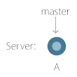
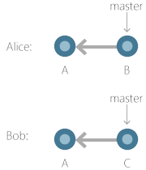
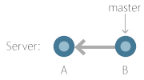
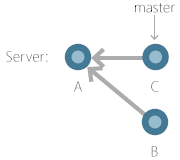
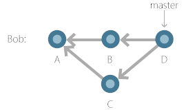
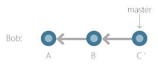

# The Race to Push
> By: Saeed Noursalehi

In a [previous article](technical-scale-challenges.md),
we talked about the issue of “too many pushes”. In a team with more than
a dozen or so members, people often end up racing with each other to
push their changes to master or another shared branch. This results in
wasted time, frustration, and reduced code quality since people can’t
take the time to fully validate their changes out of fear of losing the
race.

In this article we’ll look at the details of why this race exists, and
how we’ve solved the issue for Git repos hosted on VSTS.

## Understanding the race
A small bit of background: Git history forms a directed acyclic graph
(DAG), in which every commit has to reference a previous set of one or
more parent commits. When you fetch or push, part of what’s being
transferred between client and server is this DAG, and it is very
important to preserve the shape of the DAG in a reliable way. And as we
discussed [previously](limited-refs.md), branches are pointers to commits in this DAG.

Let’s walk through the steps that occur as you create new local commits
and then try to push a branch:

- You start by fetching, which copies the latest contents of the server’s DAG onto your local machine, and also downloads the latest branches that point to various commits in the DAG
- Then you checkout a branch, which does two things: it updates your working directory with the contents of the latest commit in that branch, and it also indicates that your next commit will reference the current tip commit as its parent
- As you edit some files and then create a new commit, Git does the following: it creates a new commit object with the contents of your edited files, it sets that commit’s parent to be the last commit that you checked out, and it advances your local branch to point to this new commit that you just created

If you then try to push this branch to the server, Git does the
following:

- Push the new commit(s) that you just created, which uploads the commit objects and their file contents to the server
- Move the server’s branch pointer from the last commit it was pointing to, to the latest commit that you just pushed

That last step, advancing the server’s branch pointer, is where the race
comes in. In theory, moving a pointer from one commit to another is no
big deal. However, part of the server’s job is to ensure that everyone’s
changes are preserved, and that one person’s push doesn’t cause another
person’s changes to get lost. If the server allowed anyone to move the
branch pointer from any commit to any other, it would be all too easy to
lose other people’s work. Let’s examine why that is.

Imagine that the server currently has one commit, named A, and a branch
named master pointing to A:

Then imagine that two people, named Alice and Bob, pull down master with
commit A and commit their own changes on top:

Alice pushes first, and succeeds in making the server’s DAG and branch look like hers:

Now if Bob pushes and isn’t stopped, the server’s DAG will look like:

Commit B still technically exists, but it’s no longer reachable from
master, or any other branch. And more importantly, Bob did not consider
Alice’s changes when constructing commit C, so commit B is effectively
lost unless Alice comes back and re-merges B into master.

To prevent this from happening, Git’s default behavior is that a push
must result in a fast-forward on the server. What this means is that the
update from the branch’s old commit to its new commit must follow a
linear path forward through the DAG. In the example above, Alice’s push
resulted in a fast-forward, because there is a path forward from A to B.
However, Bob’s push would be blocked, because there is no path that gets
from B to C, without having to move backward through the DAG.

Side note: Git allows you to override this behavior with a force push.
However, VSTS and many other services allow you to configure the repo to
block force pushes to important branches like master. It’s generally a
good idea to prevent arbitrary pushes to shared branches.

So, Bob’s push gets blocked, and Bob is now forced to fetch again, and
ensure that his push will result in a fast-forward. He can do this by
either merging:

Or rebasing:

In either case, Bob can now push to the server, because the server will
have a path available from either B to D, or B to C’. That is, Bob can
now push, as long as no one else succeeded in pushing during the window
between Bob’s most recent fetch and push.

## Impact of the race
To restate all of the above in English: you can only push to a branch on
the server if your new commits are based on the latest commit in that
branch on the server. So if anyone else pushes to that branch, you won’t
be able to push without first incorporating their changes.

When your push gets blocked, the fix is easy enough: just fetch, rebase
or merge your commits on the latest, and push again. On a small enough
team, that’s the end of the story. However, the more people there are on
a team, the more likely it is that any one person is trying to push at a
given time, until you hit a tipping point. Past that point, so many
people are in the fetch/merge/push cycle that you may never be able to
complete yours fast enough and this can result in a never-ending spiral
of fetch/merge/push/start over.

When the [VSTS repo](git-at-scale.md#medium-repos)
first moved to Git, this was one of our biggest productivity killers.
Developers would routinely get stuck in this race, unable to make
progress because 400+ other people were working as fast as they could on
their own work, preventing any of them from being able to push easily.
The only way to get a change in would be to skip all validation – fetch,
merge or rebase, and just push and hope, because any time spent
validating the final commit would likely mean that your work was wasted.
We knew that the [Windows repo](git-at-scale.md#extra-large-repos),
with its 4000 people, would have no hope if we didn’t fix this before
they came onboard.

## Solving the race
The solution is to have the server handle the race, so devs are not
reduced to staring at their screen and repeatedly clicking buttons until
their changes get through.

We briefly considered just having the server accept non-fast-forward
pushes, and then silently perform a merge on the server before advancing
the branch. This would work for many cases, but it also has some
important drawbacks:

- A dev pushes commit X to the server’s master branch, but the
  server’s master branch actually gets updated with commit Y. If the
  dev remembers to immediately pull, they can get the real commit back
  from the server, but if they forget, then their next commit will be
  based on a stale commit.
- The merge can fail, because of conflicts that can’t be
  auto-resolved. That means that sometimes your push will fail because
  of a merge conflict on the server.
- Performing the merge synchronously as part of the push could be very
  bad for performance. However, performing the merge asynchronously
  would make both of the previous points even more painful and would
  make it so devs never really know the state of master. Even worse,
  your push could “succeed” and then later be revoked because of a
  merge conflict, but there’s no good way for you to know that this
  happened.
- And in the end, we don’t want anyone pushing to master anyway. This
    race is only one issue that needs solving, but we also want to make
    sure that we can maintain high quality code in master, and not just
    allow people to push at top speed.

Due to that last point, solving the race at push time isn’t really an
option after all. But there was a better solution available.
For code quality reasons, we already require [pull requests](git-pull-requests.md) for all
changes to master. In an upcoming article, we’ll talk about [pull request policies](https://docs.microsoft.com/vsts/git/branch-policies) that allow us to implement things like required tests, code reviewers, and
custom validation.

At first glance, this may not seem all that interesting. Completing a
pull request is equivalent to pushing, and suffers from the same race.
However, the code that is performing that “complete pull request” action
is running on the server, and it is in an ideal position to solve the
race.

## Pull requests
A slight detour to explain how pull requests (PR) work: when you create
a PR, you specify a source branch, such as your topic branch, and a
target branch, such as master.

In order to show you a diff of your changes, the PR creates a merge
commit at the moment that you create the PR. This merge commit is added
to the DAG and a temporary ref is created that points to it,
named `refs/pull//merge`. This merge commit is then used to
render the diff, and also to run builds and other policies. This ensures
that the policies are evaluated on the code that will result once you
complete the PR, rather than just running on the latest of your source
branch, which could be very stale.

So early on, when you clicked on the complete button in a PR, the PR
controller would attempt to push that same merge commit object to the
target branch. However, since you typically created the merge commit and
then had to wait for code review comments, builds, etc, it was almost
certain that the push would fail because of the same race we’ve been
discussing here. So originally we had a second button that the dev could
click to recreate the merge commit, and then try again to push. And devs
would have to sit there and click “create merge”, then hope that they
click “complete” fast enough that their merge commit was still valid.
The obvious fix here was: when a dev clicks the button to complete the
PR, just assume that the merge commit that currently exists is already
stale, and create a new one before pushing. Even better, sit there in a
loop and keep recreating the merge commit and attempting to push, until
it succeeds in performing a fast-forward push on the target branch. Of
course, if there is an actual conflict on the files that you edited, the
merge creation will fail and tell you to fix the conflict, but aside
from that outcome, once you click the button, your changes are
guaranteed to get accepted into master.

Problem solved…

## Merge queues
… well not quite. The issue with leaving the solution there is that the
server ends up doing an enormous amount of wasted work. If you imagine
that 400 people are all trying to complete their PRs at once, and that
none of them have any merge conflicts, what will happen is:

- 400 people click on the complete button
- 400 PRs create a new merge commit, and try to push that to master
- 1 PR succeeds and 399 PRs fail. Return to previous step and create 399 new merge commits.
- Worst case, to complete 400 PRs, the server had to compute 80,200 merge commits. That is inefficient, to put it mildly. And it limits the rate at which the server can do useful work and complete the developers’ PRs.

The problem here is that pushing to master is fundamentally a linear
process, since every new commit has to build on the one before. So it
does no good to compute merge commits in parallel, when only one of them
can do anything useful.

Our solution was to create a merge queue for each target branch. Now
when a dev clicks the complete button, a request to complete the PR is
added to the queue, and then the server processes the queue one at a
time. For each request to complete a PR, it calculates a new merge
commit, and if there are no merge conflicts, pushes it to the target
branch. Now, to complete 400 PRs, the server has to compute 400 merge
commits.

You’ll notice that this solution is inherently asynchronous. However, we
already discussed previously that processing pushes asynchronously would
result in a bad experience for the user if they complete their PR and
think it completes, and then later get informed that it actually failed
becaue of a merge conflict. The trick to making this work well is to
make sure that the server can process merge requests fast enough that
the UX can actually remain synchronous. So the user clicks the complete
button, they see a spinner for a couple of seconds, and it either
succeeds, or it fails because of a merge conflict.

## Result
With this approach in place, and with a bunch of optimization work on
the server, the VSTS repo is now able to keep up with developers trying
to complete PRs into master, and this is no longer a bottleneck to our
productivity.

What’s more, the Windows repo is also onboard and successfully using
this system. The PR service can now complete up to 400 PRs *per target
branch, per hour*, in the Windows repo with its giant merge commits.
That is a fast enough rate that users almost never see any queue build
up, and their pushes always succeed unless there is an actual merge
conflict. Note that 400 PRs per target branch per hour is a fast enough
rate, because the 4000 devs in Windows split their work across a
hierarchy of branches. We’ll talk more about this branch structure in an
upcoming article.

## Next article in the series
- [GVFS Design History](gvfs-design-history.md)

|             |                           |
|-------------|---------------------------|
||Saeed Noursalehi is a Principal Program Manager on the Visual Studio Team Services team at Microsoft, and works on making Git scale for the largest teams in Microsoft|