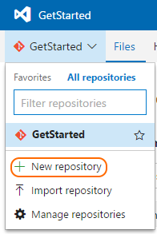
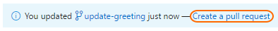

# Learn Git with Team Services
> By: Robert Outlaw

This tutorial will walk you through some basic Git tasks using Visual
Studio Team Services. You’ll work with Team Services and learn Git
basics using your web browser and a [free Team Services account](https://www.visualstudio.com/en-us/docs/setup-admin/team-services/sign-up-for-visual-studio-team-services).
This ten minute guide covers four key Git tasks:

1. Create a new repo for your code.
2. Add some code and save the changes.
3. Create a feature branch and make some changes on it.
4. Merge the changes into your master branch using a pull request.

When you’re done, you’ll have a Git repo that you can clone and use with
our [quick start guide](https://www.visualstudio.com/docs/git/gitquickstart) to get your
own code shared quickly.

### Create a new repo
Code in Git is stored in repositories, or repos. A repo isn’t much more
than a folder where Git manages your files. A repo contains the current
version of the code you are working on plus all versions of files ever
tracked.

Create a repo on the web in Team Services with the following steps:

1.  Open your account on the web. Select **Code**, then select the
    drop-down next to the current repo name and choose **New
    Repository.**  

    

2.  In the **Create a new repository** window, verify that Git is the
    repo type and enter a name for your repo. Select **Add a README**
    but leave the **Add a .gitignore** option unselected.
3.  Your repo will be created with a readme file and you can now add
    code to it.

### Add code to your repo
Now that you’ve created your repo, add some code to it. Select the **…**
next to your repo name on the left and select **Add File(s)..**.


Enter HelloWorld.html in the **New File Name** field and select **OK**.
Paste the following HTML in the editor, then select the save icon (
 )
to save your changes.

```HTML
<html lang="en">
<head>
    <title>Hello from Team Services</title>
</head>
<body>
    Hello World!
</body>
</html>
```

When you hit the save icon, a new commit was created to add the
HelloWorld.html file to your repo.  You create a new commit every time
you want to save changes in Git.

### Create a branch
So far you’ve updated code only in the `master` branch of your repo.
Branches let you save changes to your code without changing the code in
the master branch. It’s a good idea to create a new branch for each task
you’re working on to isolate changes. This means you can make a quick
bugfix on a branch without having to worry about accidentally adding
new, untested code from another branch.

Create a new branch in your Team Services repo from the web to update
the HelloWorld.html file we created earlier. From your repo, select the
dropdown next to **master** (your current branch), and select **New
Branch…**


Since you’ll use this branch to update the HTML file with a new
greeting, use `update-greeting` as the branch name. You’ll notice in the
dialog that your branch is based off the `master` branch, which is where
we saved HelloWorld.html earlier. Select **Create branch** to create the
new branch. Team Services will automatically switch you to working in
the `update-greeting` branch you just created. At this moment, no files
have changed and the contents of the two branches are identical.

Select HelloWorld.html to view the contents of the file. Select the
**Edit** button to make updates. Change the greeting to be a bit more
direct.

```HTML
<body>
    Hello everyone!
</body>
```

Select the disk icon (  )
to save your changes to a new commit on the `update-greeting` branch.
The `update-greeting` branch now points to a different version of
HelloWorld.html than the `master` branch does.

### Merge branches via pull request
Once your changes in a branch are ready you’ll need to merge them to the
`master` branch that everyone shares. Keeping `master` up to date is
important-it makes sure that your team’s new branches are based off the
most recent version of code. For that same reason, you also want to keep
your `master` branch as high quality as possible, so others don’t base
their work off buggy code.

Git combines the merge and review of code into the `master` branch
through pull requests. You create a pull requests when you’d like to
merge code from your branch into one shared by the team, such as
`master`. The pull request lists the proposed file changes, and the
reviewers of the pull request can comment and vote on if they want the
changes to be added to the shared branch.

Create a pull request for the `update-greeting` branch we created. You
will use this pull request to merge the changes you made in
HelloWorld.html into the `master` branch.

Select the **Files** link while browsing your repo. You’ll notice a
message to create a pull request for the `update-greeting` branch after
you saved the new version of HelloWorld.html in the previous
section.



Select **Create a pull request** to open a new pull request to get the
changes in `update-greeting` merged into the `master` branch.

On the create pull request page, you can see the change in the greeting
we made to the HelloWorld.html file. If this was a real pull request for
review by your team, you’d want to make sure that the title and
description were more meaningful than the default provided, as well as
add team members to the list of reviewers. Select **New pull request**.


Once the pull request is open, complete the pull request and merge the
code into `master` by selecting **Complete**, then **Complete merge**
from the drop-down. Verify the merged changes by viewing the
HelloWorld.html on your `master` branch, which will now have the
changes made in the `update-greeting` branch.

### What’s next
Now that you have a repo and are familiar with some of the basics of Git, you can follow [the Git quick start](https://www.visualstudio.com/docs/git/gitquickstart) to learn how to clone an existing repo and start working with Git using your favorite tools on your computer.

 Get started with unlimited free private Git repos in [Visual Studio Team Services](https://www.visualstudio.com/team-services/git/).

|             |                           |
|-------------|---------------------------|
||Robert is a content developer at Microsoft working on Visual Studio Team Services and Team Foundation Server.|