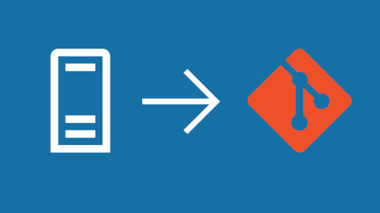

# What is Git? Tutorials
and Best Practices | Learn Git 
  [Linda
Webster](https://www.visualstudio.com/author/linda/ "Posts by Linda Webster")
  
2018-01-10T08:23:24+00:00
# Learn Git
#### Learn Git with tutorials and best practices for individuals, teams, and enterprises

## Learn Git
###### [What is Version Control?](what-is-version-control.md "What is Version Control?")
###### [What is Git?](what-is-git.md "What is Git?")
###### [Learn Git with Visual Studio Team Services](learn-git-with-team-services.md "Learn Git with Visual Studio Team Services")

## Work with Git
###### [Install and setup Git](install-and-set-up-git.md "Install and Setup Git")
###### [Setup a repository](set-up-a-git-repository.md "Setup a Git repository")
###### [Save and share code with Git](git-share-code.md "Save and share code with Git")
###### [Understand Git history](understand-git-history.md "Understand Git history")
###### [Get feedback with pull requests](git-pull-requests.md "Get feedback with pull requests")

## Switch to Git
###### [Migrate from centralized to Git](centralized-to-git.md "Migrate from centralized to Git")
###### [Migrate from TFVC to Git](migrate-from-tfvc-to-git.md "Migrate from TFVC to Git")

FEATURED
ARTICLE
### Migrate from TFVC to Git
###### By Robert Outlaw | ** Read time 6mins
###### Bring over the code in your TFVC main branch into a new Git repo, but avoid bringing over your TFVC checkin history with it. Keep your existing TFVC in the same team project as your new Git repo so you have easy access to your development history before the migration.

#### [** How we do things at Microsoft](https://www.visualstudio.com/articles/devopsmsft/overview)      [** Blog](https://blogs.msdn.microsoft.com/visualstudioalm "Blog")       [** DevOps](https://www.visualstudio.com/devops/)       [** Agile](https://www.visualstudio.com/agile "Agile")
##### [VSTS](https://www.visualstudio.com/team-services/) has the Git tools your team needs to ship great code