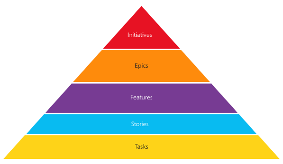
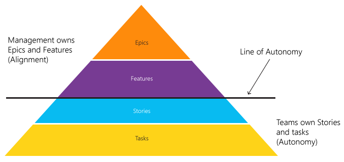

# Scale Agile to Large Teams
> By: Gregg Boer

Many people wouldn’t use the words “Big” and
“[Agile](what-is-agile.md)” in the
same sentence. Large software organizations had earned a reputation of
being big and slow to change. But that is changing. Many large
organizations have successfully made the transformation to Agile. They
have learned to scale Agile principles and have done so before scaling
frameworks such as SAFe, LeSS, or Nexus became popular.

One such group, the Team Services organization at Microsoft, builds the
Visual Studio Team Services product. Team Services has 35 feature teams
that release to production every 3 weeks.

Every team within Team Services owns everything from start to finish and
beyond. They own customer relationships. They manage their own product
backlog. They write and check code into the production branch. Every 3
weeks, the production branch is deployed and the release becomes public.
The teams then monitor system health and fix live-site issues.

According to Agile principles, autonomous teams are more productive. An
agile organization wants their teams to have autonomy over their
day-to-day execution. But autonomy without alignment would result in
chaos. 20 teams working independently would not produce a unified, high
quality product. Alignment gives teams their purpose. Alignment ensures
the teams meet organizational goals. Without alignment, even the best
performing teams would fail.

**To scale Agile, you must: enable autonomy for the team, while ensuring
alignment with the organization.**

To manage the delicate balance between alignment and autonomy, define
your taxonomy, your planning process and use feature chats.

## Taxonomy
A clearly defined taxonomy defines the nomenclature for your
organization.

An agile team needs clearly defined backlog to be successful. So does
the agile organization\! You cannot expect the teams to be successful
without clearly stating your organizational goals.

An agile organization needs to clearly define its goals and state how
each team needs to contribute to those goals. To accomplish this, you
must define a taxonomy for your organization.

A common taxonomy is Epics, Features, Stories, and Tasks.

#### Epics
Epics declare initiatives important the organizations success. Epics may
take several teams and several sprints to accomplish, but they are not
without an end. Epics have a clearly defined goal. Once attained the
Epic is closed. The number of Epics in progress should be manageable, to
keep your organization focused. Epics are broken down into Features.

#### Features
Features define new functionality required to realize an Epic’s goal.
Features are the release-unit, that is, they represent what is released
to the customer. Your published release notes can be built based on the
list of Features recently completed. Features can take multiple sprints
to complete, but should be sized to ensure a consistent flow of value to
the customer. Features are broken down into stories.

#### Stories
Stories define incremental value the team must deliver to create a
Feature. The team breaks the Feature down into incremental pieces. A
single completed story may not provide meaningful value to the customer.
However, a completed story represents production-quality software.
Stories are the team’s work unit. The team defines the stories required
to complete a Feature. Stories optionally breakdown into Tasks.

#### Tasks
Tasks define the work required to complete a Story.

#### Initiatives
This taxonomy is not a one-size-fits-all. Many organizations introduce a
level above Epics called Initiatives, Initiatives break down into
Epics.

The names of each level can be tailored to your organization. However,
the names defined above (Epics, Features, Stories) are fairly close to
being industry standard.

## Line of Autonomy
Once your taxonomy is set, define your Line of Autonomy. The Line of
Autonomy is the point at which the team is the clear owner and
management doesn’t interfere.

The example below has drawn the Line of Autonomy below Features.
Management owns Epics and Features, which provide alignment. Teams own
Stories and Tasks and have autonomy on how they execute.

Management doesn’t extend ownership below the Line of Autonomy. For
example, management doesn’t tell the team how to decompose stories, plan
their sprint, or execute their work.

The team, however, must ensure their execution aligns with management’s
goals. While a team owns their backlog of stories, they must align their
backlog with the Features assigned to them.

## Planning
To scale Agile planning, you need a plan for each level of your
taxonomy. Rolling wave planning is key: The plan provides direction for
a fixed period of time, with expected calibration on regular intervals.
For example, an 18-month plan could be calibrated every 6 months.

Here we define planning methods for each level of a taxonomy: Epics,
Features, Stories, Tasks.

#### Vision
Expressed through Epics and sets the long-term direction of the
organization. Management owns the plan and calibrates it every 6 months.
Epics define what we want to complete in the next 18 months. The Vision
is presented at an all-hands meeting. Expect to accomplish about 60% of
the Vision plan.

#### Season
Described through Features and sets the strategy for the next 6 months.
Features determine what we want to light up for our customers.
Management owns the Seasonal plan and presents the Vision and Seasonal
plans at an all-hands meeting. All team plans must align with the
management’s Seasonal plan. Expect to accomplish about 80% of the
Seasonal plan.

#### 3-Sprint Plan
Defines the Stories and Features the team will finish over the next 3
sprints. The team owns the plan and calibrates it every sprint. The team
presents the plan to management via the Feature Chat (see below). The
plan specifies how the team’s execution aligns with the 6-month Seasonal
plan. Expect to accomplish about 90% of the 3-Sprint plan.

#### Sprint Plan
Defines the Stories and Features the team will finish in the next
sprint. The team owns the sprint plan and emails it to the entire
organization for full transparency. The plan includes what the team
accomplished in the past sprint and their focus for the next sprint.

Expect to accomplish about 95% of the Sprint plan

#### Line of Autonomy
The Line of Autonomy is drawn to show where teams have planning
autonomy. The above planning process draws the Line of Autonomy as
follows:

As stated above, Management doesn’t extend ownership below the Line of
Autonomy. They provide guidance using the Vision and Season plans and
give teams autonomy to create 3-Sprint and Sprint plans.

## Feature Chats – where autonomy meets alignment
A Feature Chat is a low-ceremony meeting where each team presents their
3-Sprint Plan to management. This meeting ensures team plans align with
the organizational goals. It also helps management stays informed on
what the team is doing. While the 3-Sprint plan is calibrated every
sprint, Feature Chats are held as-needed, every 1-3 sprints.

A Feature Chat meeting allocates 15 minutes to each team. With 10
feature teams, you could schedule these meetings over a 2.5-hour time
block. Each team prepares a 3-slide deck, with the following slides:

#### Features
The features the team will light up in the next 3 sprints.

#### Debt
How the team is managing their technical debt. Debt is anything that
doesn’t meet management’s quality bars. The Director of Engineering sets
the quality bars, which are the same for all teams (alignment). Example
quality bars include \# bugs/engineer, % unit tests passing, and
performance goals.

#### Issues/Dependencies
Anything that impacts the team’s progress. Issues the team can’t resolve
or dependencies on other teams that need escalation.
Each team, not middle managers, presents their slides directly to
management. The team presents how their 3-Sprint plan aligns with the
6-month seasonal plan. Leadership asks clarifying questions and suggests
changes in direction. They can also request follow-up meetings to
resolve deeper issues.

If a team’s plan fails to align with management’s expectations,
management may request a re-plan. In this rare event, the team will
re-plan and schedule a second feature chat to review it.

## Trust – the glue that holds it alignment and autonomy together
When practicing Agile at scale, trust is a 2-way street:

*Management must trust teams to do the right thing. If management
doesn’t trust the teams, they won’t give teams autonomy.*

*A team earns trust by consistently delivering high quality code. If
teams aren’t trustworthy, management won’t give them autonomy.*

Management must provide clear plans for teams to align with and trust
their teams to execute. Teams must align their plans with the
organization and execute in a trustworthy manner.

As you look to scale agile to large organizations, the key is to give
teams autonomy while ensuring they are aligned with organizational
goals. The critical building blocks are clearly defined ownership and a
culture of trust. Once you have this foundation in place, you will find
that Agile can scale very well.

 Get started with free agile tools in [Visual Studio Team Services](https://www.visualstudio.com/team-services/agile-tools).

|             |                           |
|-------------|---------------------------|
||Gregg Boer is a Principal Group Program Manager at Microsoft. He works in the Microsoft’s Visual Studio Cloud Services (VSCS) division. A big believer in the benefits of Agile, Gregg drives the vision for Agile management solution provided by Microsoft’s Visual Studio Team Services and Team Foundation Server products.|