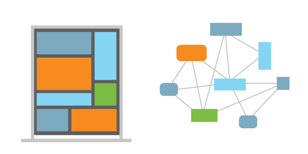

# What are Microservices? | Learn DevOps
### By Sam Guckenheimer

# What are Microservices?
### By Sam Guckenheimer

*Microservices* describes the architectural pattern of composing a
distributed application from separately deployable services that perform
specific business functions and communicate over web interfaces. DevOps
teams encapsulate individual pieces of functionality in microservices
and build larger systems by composing the microservices like building
blocks. Microservices apply an example of the open/closed principle:
they are open for extension (using  the interfaces they expose), and
closed for modification (in that each is implemented and versioned
independently).
Microservices provide many benefits over monolithic architectures. They
can remove single points of failure (SPOFs) by ensuring issues in one
service do not crash or impact other parts of an application. 
Individual microservices can be scaled out independently to provide
additional availability and capacity. DevOps teams can extend
functionality by adding new microservices without unnecesarily 
affecting other parts of the application.
Using microservices can increase team velocity. DevOps practices, such
as Continuous Integration and Continuous Delivery, are used to drive
microservice deployments. Microservices nicely compliment cloud-based
application architectures by allowing software development teams to take
advantage of several patterns such as event-driven programming and
autoscale scenarios.  The microservice components expose APIs
(application programming interfaces), typically over REST protocols for
communicating with other services.
An emerging pattern is to use container clusters to implement
microservices. Containers allow for the isolation, packaging, and
deployment of microservices, and orchestration scales out a group of
containers into an application.
Learn more about [microservices on
Azure](https://azure.microsoft.com/en-us/documentation/articles/service-fabric-overview-microservices/ "Microservices on Azure service fabric.").
  [Sam
Guckenheimer](https://www.visualstudio.com/author/samgu/ "Posts by Sam Guckenheimer")
  
2017-05-25T14:06:26+00:00 

### Sam Guckenheimer
Sam Guckenheimer works on Microsoft Visual Studio Cloud Services,
including VS Team Services and Team Foundation Server. He acts as the
chief customer advocate, responsible for strategy of the next releases
of these products, focusing on DevOps. He has written four books on
DevOps and Agile Software practices.