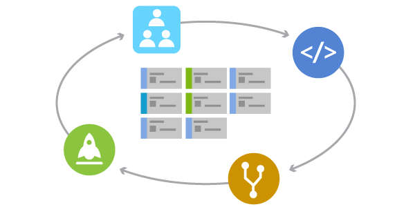

# What is Agile?
> By: Aaron Bjork

  
Agile is a term used to describe approaches to software development
emphasizing incremental delivery, team collaboration, continual
planning, and continual learning. The term “Agile” was coined in 2001 in
the [Agile Manifesto](http://agilemanifesto.org/). The manifesto set out
to establish principles to guide a better approach to software
development. At its core, the manifesto declares 4 value statements
representing the foundation of the agile movement. As written, the
manifesto states…
We have come to value:

- Individuals and interactions over processes and tools
- Working software over comprehensive documentation
- Customer collaboration over contract negotiation
- Responding to change over following a plan

This does not imply the items on the right side of these statements
aren’t important or needed; rather, items on the left are simply more
valued.

## Agile methods and practices

It’s important to understand that agile is not a “thing” … you don’t “do
Agile”. Rather, agile is a mindset. A mindset that drives an approach to
software development. There’s not one approach here that works for all
situations, rather the term “Agile” has come to represent a variety of
methods and practices that align with the value statements in the
manifesto.
Agile methods (often called frameworks) are comprehensive approaches to
phases of the software development lifecycle –  planning, execution, and
delivery. They prescribe a method for accomplishing work, with clear
guidance and principles.
[Scrum](what-is-scrum.md) is the most
common agile framework (and the one most people start with).
Agile practices on the other hand, are techniques applied during phases
of the software development lifecycle. [Planning
Poker](https://www.agilealliance.org/glossary/poker/) for example, is a
collaborative estimation practice designed to encourage team members to
share their understanding of what “done” means. The process is quite
fun, and has proven to help foster teamwork and better estimates.
[Continuous
Integration](what-is-continuous-integration.md)
(also known as CI) is a common agile engineering practice where code
changes are integrated into the main branch frequently.  An automated
build verifies changes, leading to a reduction in integration debt and a
continually shippable main branch. These practices (like all agile
practices) carry the “Agile” label, because they are consistent with the
principles in the agile manifesto.
## What agile isn’t
As agile has gained popularity, many stereotypes and/or
misinterpretations have cast a negative shadow regarding its
effectiveness. It’s easy to say “*Yes, we’re doing Agile*”, without any
accountability. Considering this, let’s look at a few things that Agile
isn’t.
  - Agile is not [cowboy
    coding](https://en.wikipedia.org/wiki/Cowboy_coding). Agile should
    not be confused with a “we’ll figure it out as we go” approach to
    software development. This couldn’t be further from the truth. Agile
    requires both a [Definition of
    Done](https://www.agilealliance.org/glossary/definition-of-done/)
    and value delivered to customers in every sprint. While Agile values
    autonomy for individuals and teams; Agile emphasizes aligned
    autonomy, ensuring the delivery of increased value through increased
    autonomy.
  - Agile is not without rigor and planning. On the contrary, Agile
    methodologies and practices typically emphasize discipline in
    planning. The key is continual planning throughout the project, not
    just planning up front. Continual planning ensures the team can
    learn from the work they’re executing, thus maximizing planning ROI
    (return on investment).
> “Plans are worthless, but planning is everything.” — Dwight D.
> Eisenhower
  - Agile is not an excuse for the lack of a roadmap. This one has
    probably done the most harm to the agile movement overall.
    Organizations and teams following an Agile approach absolutely know
    where they’re going… and the results they want to
    achieve. Recognizing change as a part of the process (an agile
    approach) is different from pivoting in a new direction every week,
    sprint, or month.
  - Agile is not development without specifications. It’s necessary in
    any project to keep your team aligned on “why” and “how” work will
    happen. An agile approach to specs includes ensuring specs are
    “right-sized”, and reflect appropriately how the team will
    sequence and deliver work.
## Why agile?
So why would anyone consider an agile approach? It’s clear the rules of
engagement around building software have fundamentally changed in the
last 10-15 years. Many of the activities look similar, but the landscape
and environments where we apply them are noticeably different. Consider
for a moment what it’s like to purchase software today… when compared to
the early 2000’s. When was the last time you drove to the store to buy
software? Consider how you collect feedback from the customers using
your products. How did we understand what people thought about our
software before social media? Finally, think about how often you desire
to update and improve the software you’re delivering. Delivering updates
once a year doesn’t sound like a recipe for winning. Forrester’s Diego
Lo Guidice and Dave West said it best in paper titled *Transforming
Application Delivery* (February of 2011).
> “Firms today experience a much higher velocity of business change.
> Market opportunities appear or dissolve in months or weeks instead of
> years. “ — Diego Lo Guidice and Dave West, Forrester
The rules have changed, and organizations around the world are now
adapting their approach to software development accordingly. Agile
methods and practices don’t promise to solve every problem. But they do
promise to establish a culture and environment where solutions emerge…
through collaboration, continual planning and learning, and a desire to
ship high quality software more often.
   

Get started with free agile tools in [Visual Studio Team
Services](https://www.visualstudio.com/team-services/agile-tools).
  [Aaron
Bjork](https://www.visualstudio.com/author/abjork/ "Posts by Aaron Bjork")
  
2017-10-03T12:25:24+00:00 

### Aaron Bjork
Aaron is a Principal Group Program Manager at Microsoft where he drives
investments in work management, agile project management, reporting, and
collaboration for Microsoft’s Visual Studio Team Services (VSTS) and
Team Foundation Server (TFS) products.