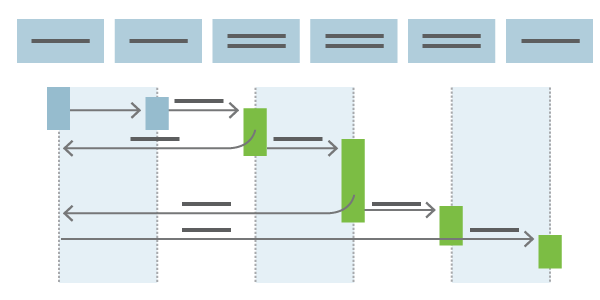

# What is Continuous Delivery?
> By: Sam Guckenheimer

  
Continuous Delivery (CD) is the process to build, test, configure and
deploy from a build to a production environment. Multiple testing or
staging environments create a *Release Pipeline* to automate the
creation of infrastructure and deployment of a new. Successive
environments support progressively longer-running activities of
integration, load, and user acceptance testing. [Continuous
Integration](what-is-continuous-integration.md "Continuous Integration")
starts the CD process and the pipeline stages each successive
environment the next upon successful completion of tests.
Continuous Delivery may sequence multiple deployment “rings” for
progressive exposure (also known as “controlling the blast radius”).
Progressive exposure groups users who get to try new releases  to
monitor their experience in “rings.”  The first deployment ring is often
a “canary” used to test new versions in production before a broader
rollout. CD automates deployment from one ring to the next and may
optionally depend on an approval step, in which a decision maker signs
off on the changes electronically. CD may create an auditable record of
the approval  in order to satisfy regulatory procedures or other control
objectives.
Without Continuous Delivery, software release cycles were previously a
bottleneck for application and operation teams. Manual processes led to
unreliable releases that produced delays and errors. These teams often
relied on handoffs that resulted in issues during release cycles. The
automated release pipeline allows a “fail fast” approach to validation,
where the tests most likely to fail quickly are run first and
longer-running tests happen after the faster ones complete successfully.
Continuous Delivery is a lean practice. The goal of CD is to keep
production fresh by achieving the shortest path from the availability of
new code in version control or new components in package management to
deployment. By automation, CD minimizes the time to deploy and *time to
mitigate* or *time to remediate* production incidents (TTM and TTR).  In
lean terms, this optimizes process time and eliminates idle time.
Continuous Delivery is helped considerably by the complementary
practices of [Infrastructure as Code](what-is-infrastructure-as-code.md)
and
[Monitoring](what-is-monitoring.md).
Continuously delivering value has become a mandatory requirement for
organizations. To deliver value to your end users, you must release
continually and without errors.
Continuous Delivery also supports two other patterns for progressive
exposure beside sequential rings. “Blue/Green  deployment” relies on
keeping an existing (blue) version live while a new (green) one is
deployed. Typically, this uses load balancing to direct increasing
amounts of traffic to the green  deployment. If monitoring discovers an
incident, traffic can be rerouted to the blue deployment still running.
“Feature flags” (or “feature toggles”) comprise another technique used
for experimentation and “dark launches.”  Feature flags turn on features
on or off for different end users based on their identity and group
membership.
Modern release pipelines allow development teams to deploy new features
fast and safely. Issues found in production can be remediated quickly by
rolling forward with a new deployment. In this way, CD creates a
continuous stream of customer value.
Read more about the Continuous Delivery capabilities of [Visual Studio Team Services](https://www.visualstudio.com/team-services/release-management__trashed/ "Continuous Delivery with VSTS").
Learn how to set up Continuous Deployment to
[Azure](https://www.visualstudio.com/en-us/docs/release/examples/examples).
See how [Bing is using Continuous Delivery](http://stories.visualstudio.com/bing-continuous-delivery/ "Continuous Delivery at Bing")with
Visual Studio Team Services.

|             |                           |
|-------------|---------------------------|
||Sam Guckenheimer works on Microsoft Visual Studio Cloud Services, including VS Team Services and Team Foundation Server. He acts as the chief customer advocate, responsible for strategy of the next releases of these products, focusing on DevOps. He has written four books on DevOps and Agile Software practices.|