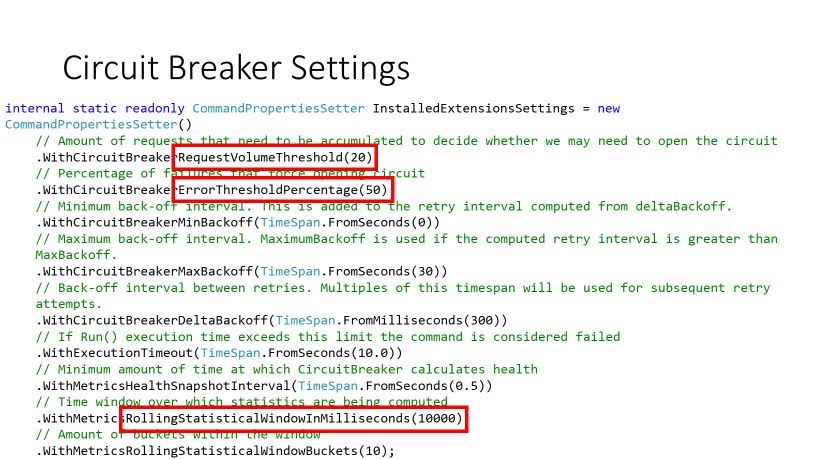
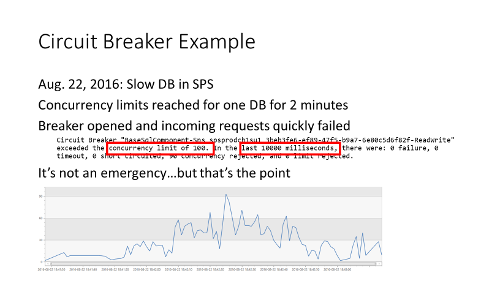
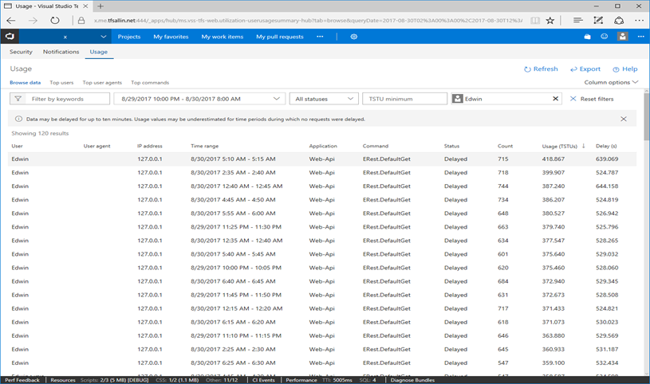
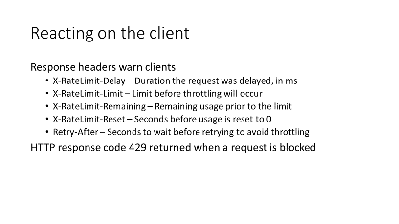

# Patterns for Resiliency in the Cloud

> By: Buck Hodges

We use feature flags, and they’re awesome, right? What could possibly go
wrong? Let’s rewind to November 2013 at the Connect() conference. We had
a bunch of new functionality we wanted to roll out. And ahead of the
conference we said, “Hey, we want to keep this stuff super-secret until
the keynotes, which were at 9:00 AM, and we’re going to flip the feature
flags at 8:00 AM right beforehand.” It didn’t go well.

> [!VIDEO https://www.youtube.com/embed/yVnVY2HPVsI]

Brian Harry was on the phone from New York. I’m sitting at my desk. He
calls me and in so many words asks, “What’s going on?” We’re trying to
sort this out. Thankfully, somebody had the foresight to put together a
deck with screen shots in case things weren’t working. His manager,
Soma, could do his talk without the system live. Back then we only had
one instance. So this problem affected the whole world, the blast radius
was global.

We had all kinds of problems. [It took a couple of weeks to root-cause everything](https://blogs.msdn.microsoft.com/bharry/2013/11/25/a-rough-patch/).
The worst thing was that this happened on launch day, Wednesday November
13. We sent the system into a tailspin, because we flipped on so many
different features flags. We had many new features, and clearly we
hadn’t understood all the interactions and certainly not at production
scale.

We had all kinds of things happen. For example, we were running out of
ports in the load balancer. With TCP/IP, you’ve got 16 bits for the
port. If you need more than 64,535, you’re going to run out. We realized
from that experience that flipping on a bunch of feature flags right
before somebody gets on stage is a bad idea.

What do we do differently now? We turn the flags on incrementally and at
least 24 hours ahead of any event. Now, we may hide a few last things
like we might have a button that doesn’t show up, but everything else is
on. We solicit our best customers to try everything out. Showing that we
learn from the past, in November 2015, we rolled out the marketplace.
That one went really well. But we had everything turned on in that case
for about 48 hours before the event, so we had tested it in production.
We had tried it and had other people try it. It was a totally different
experience.

## Circuit Breakers
In the early days, we had no notion of any kind of resiliency. There’s
going to be failure in the cloud. How do we deal with that? There are
the two patterns that we primarily rely on so far. The first one is
[circuit breakers](https://docs.microsoft.com/en-us/azure/architecture/patterns/circuit-breaker).
This originated at Netflix.

The goal of a circuit breaker, much like you would find in an electrical
panel, is to stop the failure from cascading. When you drop a hair dryer
in a bath tub, the breaker pops and it shuts the circuit off. The damage
is limited to that one item and not the rest of the electrical system.
Circuit breakers in the cloud help us protect against latency and
concurrency causing the entire system to grind to a halt.

### Latency is a Form of Failure
Latency means that something takes too long. Latency is the same as
failure. If it takes you five minutes to save a work item, we’re down.
Technically you might be able to do it, but you can’t get your job done,
so we’re down. Failing slowly is the most insidious thing. If you fail
fast, you can actually deal with the failure reasonably, but if it takes
you five minutes to fail, then recovery becomes a challenging problem. I
tell people when they think about failure to think about things that are
just simply too slow because that’s the harder case.

### Concurrency
Then there’s volume due to concurrency. For example, if resources that
we depend on, like SQL Azure, limit simultaneous connections, then
exceeding the limit creates problems. How do we prevent issues just due
to too many calls at once? We need to be able to shed load quickly. If
something bad happens, a lot of times the requests will pile up.

In the old days before we had any circuit breakers, the database might
have had a problem. Let’s say we roll out a bug, and the database is
unhealthy and pegging the CPU. Well, while that’s happening, we’re
queuing up a bunch of calls in ASP.NET. Then somebody figures out how to
fix the problem. What happens next? Boom, here comes this whole wave of
calls. So, we made the database healthy, but now it has to deal with so
many simultaneous calls at a sustained rate that it goes down again and
the cycle repeats. It is a kind of death spiral. The whole point of
circuit breakers is to shed load quickly. That way so we keep things
from queuing up and limit the pending load in order to allow the system
to recover.

### Fall Back and Degrade Gracefully
A key with circuit breakers is, when you’re going to fail, to fall back
and degrade gracefully. For some features that’s easy and for some it’s
hard. If we can’t call Azure Active Directory, there’s no graceful
alternative. You are either signed in good to go or you haven’t signed
in, and there’s nothing we can do about it.

But for other things you can fall back. For example, if we can’t get to
the extension management system, we’ll assume you have access to that
extension that was requested and not disrupt your work. Some things have
choices; some don’t. Here’s a quick diagram of what a circuit breaker
looks like.

As calls come in and go through the circuit breaker, normally the
circuit breaker is closed. Normally things are flowing through. The
breaker is looking at the failure rates. When the failure rates exceed
some percentage in a given window of time with a certain volume, the
breaker opens. And when it opens it just starts failing calls. You may
have a problem in the code and that problem might have been triggered by
somebody’s behavior, but we’re going to start failing all those calls to
save the system. Circuit breakers are all about saving the system to
prevent failure from spreading through the rest of system. This is a
blunt instrument but effective.

### Half Open
Now if I fail all the calls, how do I know when to reclose? In order to
see if it’s safe, the circuit breaker occasionally lets something
through as a test. Suppose you have a thousand calls a second. When the
breaker opens, you may let 10 go through, because you’re trying to
figure out if the system is healthy. Opening the breaker takes pressure
off the dependent resource. But we need to feed a little bit of traffic
through to find out whether the resource is working, because at some
point we need to reclose the breaker and go back to normal. That’s
represented in the state diagram as *half open*.

Now what does that look like in code? Here is a set of properties on a
circuit breaker, as shown in this example.

The defaults for all these settings are particularly important. One is
request volume, how much volume do I have to have coming through the
circuit breaker for it to start analyzing things? What is my error
threshold? How many or what percentage can fail and still stay closed?
At what point should it open? Then what is my time window? What window
do I want to analyze this over? Could be seconds could be minutes it
could be any number of things.

### Get the Fallback Method Right
You have to think about how the circuit breaker should analyze the calls
that are coming through. If the extension mechanism fails, what should
we do? This fallback method will determine what actually happens when
the circuit breaker opens. What response do the callers get?
This made a huge difference for us. When we think about things like
concurrency, if I get an overwhelming number of requests, then based on
the settings on the circuit breaker, the circuit breaker opens. The best
example is SQL Azure. SQL Azure limits how many connections you can have
open and we need to protect that.

We also want to make sure that if optional services do not impede
critical ones. You can take circuit breakers and create *bulkheads*.
Bulkheads allow only a defined amount of traffic from optional calls, in
order to preserve capacity for connections from critical services, such
as Identity.

Let’s look at an example. This was one where we had a slow DB and due to
a bug in SPS. We hit the concurrency limits for one DB for two minutes
and the circuit breaker opened.

We had passed the concurrency limit of 100, and the opened breaker
started causing requests to fail. We don’t take this lightly. If a
circuit breaker opens and starts failing requests, somebody’s having a
bad experience. You’re getting errors because of this circuit breaker,
but the system keeps working. Instead of devolving into some incident
that effects an entire partition DB with 40,000 accounts in it, we
affect, let’s say, a couple hundred people. It’s bad for those affected
users and we need to go figure out why this happened and go fix it. But
it’s also not a giant emergency. It becomes something that can be
handled as not an emergency, but something we do normally as part of our
daily work.

The point is to avert the emergency, keep the system healthy, and not
let it go down. This is what circuit breakers do for us.

## Tune Circuit Breakers in Production
If you tell me, “Hey I’ve added a circuit breaker to my code–I’m
resilient now,” I’m going to ask, “Have you tested it in production?” If
you say no, you’re not resilient. Circuit breakers are only good if they
work, and their failure cases are right. The failure cases must be
tested.

### Test Fallbacks
We need to try breakers out in production. The great thing about having
these canary instances is that we can have them fail and force the
circuit breakers open. We’ll do things like just go open circuit
breakers on the canary. We may also intentionally add a bunch of calls
that intentionally fail. We hook the code and have the code return
failure every time so that we can see how the system works with the
fallback.

### Test Timeouts
Timeouts are the other interesting thing about circuit breakers. The
circuit breaker’s looking at some period, say 30 seconds. How do these
two things interact with each other? How do the other parts of the
system react when the circuit breaker opens? None of this stuff is
believable to me, until you’ve tested it in production. This is the
reason Netflix uses chaos monkey in production. It’s only trustworthy if
you can prove it.

### Monitor During Fallback
We need to verify the fallback. Does it really help? Does it work? How
are you going to know? You need monitoring to find out. The absence of
failure is not success. When you open a circuit breaker and test it,
maybe nothing bad happens which means your co-workers aren’t
complaining. You need to look for exceptions that you didn’t expect. If
suddenly the “foo” exception starts going through the roof, you need to
understand why and root-cause that.

### Make the Cause of a Tripped Breaker Obvious
Again, you want to be able to depend on circuit breakers in an
emergency, and an emergency is the wrong time to find out if it works.
Make it easy to understand what causes a circuit breaker to trip. You’d
be surprised that when we started using these, it took us a long time to
figure out why they would open. We realized our telemetry wasn’t very
good. There are always multiple layers of cause. You’ve got to keep
walking backwards until you find the root cause. Your very first step
is, *Why did it open?* If circuit breakers are opening, it’s always a
symptom, and it’s never a cause.

## Throttling to Control Resource Utilization
A more targeted version of controlling traffic is
[throttling](https://docs.microsoft.com/en-us/azure/architecture/patterns/throttling).
This is about limiting the load generated by an identity. One of our
common examples is a complex build definition. Another example is an
automation tool that queries the system for some piece of information
like work items, and it’s run with no constraints. When this happens,
one identity can consume an outsized amount of resources. We want to be
able to react to that and not let that “noisy neighbor” cause other
people problems. Unlike circuit breakers, we want to target just the
offender, not other people.

We also need to be able to let people know when they are approaching or
hitting the limits.

That’s the purpose of this page in your account. You can see the impact
you’re having now. This page helps you understand if you’re getting
throttled and why.

There are two main mechanisms here: delay and blocking. The first
response is to delay. If it’s sufficient to slow things down, then delay
is all that is used. If not, then the calls will be blocked, meaning
everything you call just fails. There’s some window of time that you
want to look at to determine how much the given user is consuming in
your system.

### How the Client Handles Back Pressure
To do this we want to allow you as a caller to understand when you are
getting close to the limits or when are you being blocked. Can your tool
can react to it?

In resiliency there’s a general concept of back pressure. If I make a
call to the server and the server is struggling, and the server responds
to you to back off, that’s back pressure. It’s pressure being pushed
back to the client, and the clients should react to it intelligently,
for example, to pause. For the client to react, we give you a set of
response headers.

The client can read the headers to see what’s going on. The server is
going to tell you, “I delayed you this much, and if you go beyond this
limit we’re going to block you. We’re going to flat-out throttle you if
you don’t back off.” The service provides the client information to
allow the client to react intelligently. If the client is blocked, the
server will send a 429, so that you know the call failed and why.

## Using XEvents
So how do you implement throttling? We use [SQL Server Extended Events
(XEvents)](https://docs.microsoft.com/en-us/sql/analysis-services/instances/monitor-analysis-services-with-sql-server-extended-events)
to get much of the information we need. Since so much of our service is
dependent on SQL, this is really the key piece for us. This ability to
accurately attribute that usage to the particular call and the identity
that’s causing the throttle is really key, because that lets us go after
the offender and not just hit everybody with a hammer. The other thing
that’s really cool about XEvents is they’re very lightweight. They’re
also asynchronously collected. We then pump the XEvents into Azure Log
Analytics.

## Rolling Out Limits
Since we didn’t always have throttling, we had to incrementally roll out
limits. It was a challenging conversation with some customers. I do tell
people today that as you build new features, think about the limits,
think about how you need to put resource utilization in there from day
one, so that you don’t have to come back and start negotiating with
people on taking the limits down.

As I mentioned delaying is effective. However, if some application is
flooding the system with requests, you’re going to have to block. We
need to help the user understand why. If I block you or delay you and
you can’t tell why, that’s a miserable black box to you.

You also have to tune in production. If you put in limits for resource
utilization and you don’t try them out in production, they you may not
have the limits you think. Resource utilization, circuit breakers,
timeouts: all these things can interact in interesting ways. If I start
throttling you and you keep retrying, you’ll eventually get blocked.
These are the sort of interesting interactions that happen in the system
that you have to try out in production.

## Lessons Learned
We started off with evolving in flight. This is key. A lot of customers
ask me, “Should I go fix my architecture now? Or should I get started?”
I believe it’s best to get started because I think you will learn a lot.
You’ll make different decisions than you would if you just imagined what
it’s like and try to build that.

That’s going to force changes on you. You’re going to have to figure out
multi-tenancy. You’re going to have to figure out online upgrades. If
you can have a common server framework, I think it’s highly valuable.
You get to leverage that and reuse it across many services. There’s a
lot of economies of scale there.

We had to adopt cloud principles. This was really a mindset shift for
the whole team. We had to add tracing, which is brand new to an on-prem
team. *Trace everything.* Even when you think you’re tracing too much,
trace more. Feature flags, circuit breakers, resource utilization, each
of these things were new concepts for us. In the case of feature flags
they allow us to control exposure, to get feedback, and to do
experiments that we never could do before.

Resiliency in the cloud is a very different thing. We have to think
about failure. We are responsible for the service for many customers.
Therefore, we need to make the service as resilient as possible to
things going wrong. Despite all your best planning, despite all your
best testing, things will go wrong and you need to recover.

|             |                           |
|-------------|---------------------------|
||Buck Hodges is Director of Engineering for Visual Studio Team Services. He's been a member of the team since the beginning of TFS, starting as a developer on Team Foundation Version Control for the first version of TFS. He's helped lead the transition of the team to the cloud and DevOps.|