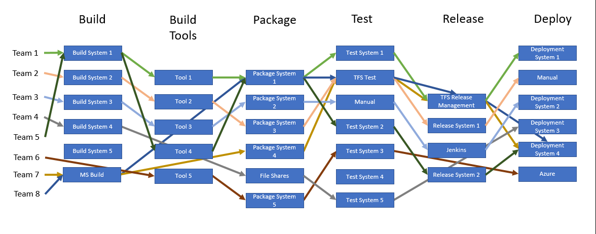
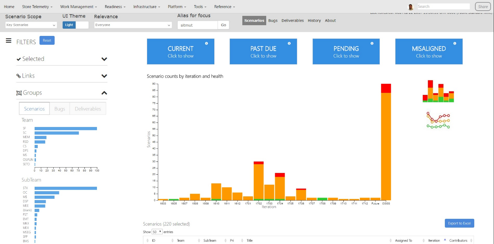

# Universal Store: Journey to Continuous Delivery and DevOps
> By: Sam Guckenheimer

## Overview

The “Microsoft Universal Store Team” (UST) is the main commercial engine of Microsoft with the mission to bring One Universal Store for all commerce at Microsoft. The UST encompasses everything Microsoft sells and everything others sell through the company, consumer and commercial, digital and physical, subscription and transaction, via all channels and storefronts.

To achieve the objective of one Universal Store, UST had to bring together multiple teams from across Microsoft with different engineering systems, engineering culture, and processes into one streamlined delivery cadence catering to cost, agility and quality needs of the business.
**Continuous Delivery** is a key part of the UST transformation. Visual Studio Team Services (VSTS) in the Microsoft One Engineering System (1ES) made continuous delivery practical for the UST. This case study provides an overview of the approach, the challenges and the process adopted to help achieve the objective.

## DevOps Improvements at a Glance

The UST piloted VSTS in December 2015 through Feb 2016 and went into production in March 2016. The fastest way to see the changes is to contrast a few key metrics, showing improvement of 40x to 8000x year over year.

|                                   | **December 2015** | **December 2016**                                      |
| --------------------------------- | ----------------- | ------------------------------------------------------ |
| Number of active services on VSTS | \< 10             | 800 +                                                  |
| Monthly active users (GIT)        | \< 100            | 4000 +                                                 |
| Builds per month                  | \< 50             | 400K +                                                 |
| Production deployments per month  | \< 100            | 10K +                                                  |
| Builds with automated tests run   | 0                 | ~ 30%                                                  |
| Build wait time                   | N/A               | 0 minutes (median) 0 minutes (75th) 1 minute (90th)    |
| Time to complete CI build         | N/A               | 8 minutes (median) 12 minutes (75th) 23 minutes (90th) |

## Before DevOps

Before moving to DevOps, the UST had seven disparate engineering systems, with source code distributed across multiple TFS instances, many custom build, test and deployment solutions, with different release workflows, policy requirements and compliance needs.

Culturally, teams had varying levels of delivery maturity and engineering processes. Business problems came first, and engineering debt accumulated on different legacy systems over a period of time. Teams also had been reorganized and felt fatigue migrating from one custom solution to another. On top of that, the 1ES was not mature enough to handle UST’s scale. No-one was excited about continuous delivery since it involved yet another ES migration.

## Guiding Principles Moving to DevOps

The UST put a set of principles in place to make the transformation to DevOps a “north star”.
**1ES Alignment**. Leverage the investment Microsoft was making more broadly in a common engineering system. Contribute back to improve the 1ES when appropriate.  
**Build First, Standardize Next**. Prove the best in class systems and tools in practice first, then drive to standardize on them to shorten the learning curve.  
**Extend to 3rd party**. Use the opportunity of internal solutions for 1ES to identify what can work for external customers (“3rd party”) where possible.  
**Perform While Transform**. Reduce cost and cycle time and improve code velocity. Consistently deliver and show incremental value with each iteration.  
**Continuous learning**. Gather constant user feedback to learn and improve continuously.  
**Self-service**. Create a lean operational footprint, with better scale, reliability and performance by allowing engineers to set up their own environments.

## Results: Continuous Integration and Continuous Delivery

### Git

Git under VSTS is now the standard version control for UST, with more than 2000 Git repos in use among 4000 monthly active users. The UST transitioned from centralized version control to Git in the beginning of 2016 and currently more than 70% of the code bases in UST are in Git.
As part of the process, we were also able to drive productivity improvements by consolidating or retiring several legacy services and their code bases.

### Package Management

UST retired its custom NuGet servers and moved to VSTS native package management. This has resulted a trusted package feed with higher reliability. Teams are now empowered to manage their own feeds helping with version control and standardization.

### Deployment

UST now has more than 10,000 monthly deployments through VSTS Release Management, up from 0 at the beginning of 2016. Most UST services use an experimentation service called AutoPilot. Teams therefore required help in moving their workflows into VSTS with deployment into AutoPilot. We had a-la-carte of tools to help this including a custom solution for E2E delivery (from modeling to release) and VSTS tasks for deploying binaries to AutoPilot. This resulted in a 72% MoM growth of VSTS deployments within the first 6 months.

### Agile Work Management

The UST leverages the work management features heavily to track stories, scenarios and work items at the team level. At the same time, the UST wanted to consolidate portfolio views integrating multiple data sources by organizational structure. To help with this, the UST created a Team Map to align organizational data to other data domains such as VSTS Area Paths.

### Continuous Testing in DevOps

Testing practices had to change radically to enable this level of automation. In UST, teams had set of tests which they wanted to reuse. UST provided them with plug-ins for running existing Selenium and JavaScript test cases to unblock them with integration issues. Currently 30% of our builds have automated tests as part of the build definitions.

### Microservices

Moving to DevOps has enabled an architectural move to refactor previous monoliths into microservices. The UST uses a declarative service model to decouple its functions into discrete services.

### Internal Open Source: Contributions Back to VSTS

When UST needed more capabilities in VSTS to accelerate the adoption of continuous delivery, UST contributed to the VSTS project directly. In this way, UST could make VSTS better for everyone rather than create custom tooling. The following table lists the VSTS features contributed to by UST.

## Key learnings

### Continuous Delivery is the Goal

Moving to Continuous Delivery requires changes in process and culture, not just tools. To get the business results, it is not enough to move code and process. You have to see the value in faster delivery to end-users.

### Focus on small wins

The UST split its transformation into several phases – a phase each for work items, code, build, test and release / deployment. The pace and timing varied from one team to the next. Teams could choose to onboard to any phase in any order, although the typical sequence was to migrate code first, and then build, test and deployment. The teams would plan the work for onboarding for each phase and create a set of actions and a timeline based on their individual needs.

### Kickstart the effort with coaching

Embedded SMEs partnered with teams to migrate their first service and coach users through onbarding their first project and overcoming the adoption barriers.

### Enable developer self service

A principle was to help engineers and teams move as fast as they wanted. UST avoided central processes that hinder agility. For tooling, the UST created extensions in VSTS extensions to automate release workflows. Self-help tools facilitated repetitive management tasks. Individual teams could determine their own policy and compliance tasks.

## Summary

The adoption of retail VSTS and 1ES tools have been critical to the success of UST. They enable a high degree of collaboration, a consistent way of managing code and releases across several services and teams and a means to share knowledge and best practices in a diverse environment.

|             |                           |
|-------------|---------------------------|
||Sam Guckenheimer works on Microsoft Visual Studio Cloud Services, including VS Team Services and Team Foundation Server. He acts as the chief customer advocate, responsible for strategy of the next releases of these products, focusing on DevOps. He has written four books on DevOps and Agile Software practices.|