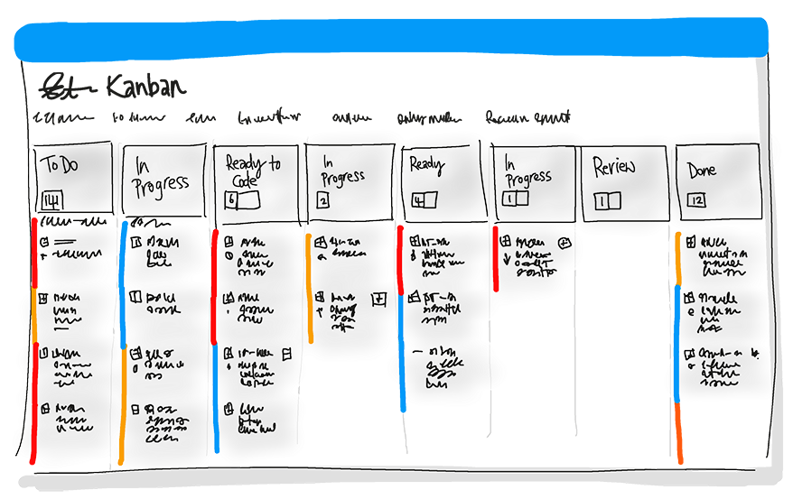

# What is DevOps?
> By: Sam Guckenheimer

DevOps is the union of people, process, and products to enable continuous delivery of value to our end users. The contraction of “Dev” and “Ops” refers to replacing siloed Development and Operations to create multidisciplinary teams that now work together with shared and efficient practices and tools. Essential DevOps practices include agile planning, continuous integration, continuous delivery, and monitoring of applications.

## Getting to DevOps

Be not afraid of DevOps. Some teams are born to DevOps; some achieve DevOps; others have DevOps thrust upon them.3 What is DevOps? Why does DevOps matter? Why now? How do you achieve DevOps successfully? Those are the topics we’d like to look at.

## Understand your Cycle Time
Let’s start with a basic assumption about software development. We’ll describe it with the OODA loop.4 Originally designed to keep fighter pilots form being shot out of the sky, the OODA loop is a good way to think about staying ahead of your competitors. You start with observation of business, market, needs, current user behavior, and available telemetry data. Then you orient with the enumeration of options for what you can deliver, perhaps with experiments. Next you decide what to pursue, and you act by delivering working software to real users. All of this occurs in some cycle time.

## Become Data-Informed
Hopefully, you use data to inform what to do in your next cycle. Many experience reports tell us that roughly one-third of the deployments will have negative business results, roughly one third will have positive results, and one third will make no difference. Ideally, you would like to fail fast on those that don’t advance the business and double down on those that support the business. Sometimes this is called pivot or persevere.

## Strive for Validated Learning
How quickly you can fail fast or double down is determined by how long that loop takes, or in lean terms, by your cycle time. Your cycle time determines how quickly you can gather feedback to determine what happens in the next loop. The feedback that you gather with each cycle should be real, actionable data. This is called validated learning.

## Shorten Your Cycle Time
When you adopt DevOps practices, you shorten your cycle time by working in smaller batches, using more automation, hardening your release pipeline, improving your telemetry, and deploying more frequently.6

## Optimize Validated Learning
The more frequently you deploy, the more can experiment, the more opportunity you have to pivot or persevere, and to gain validated learning each cycle. This acceleration in validated learning is the value of improvement. Think of it as the sum of improvements that you achieve and the failures that you avoid.

## How to Achieve DevOps

Remember, the goal is to shorten cycle time. Start with the release pipeline. How long does it take you to deploy a change of one line of code or configuration? Ultimately, that’s the brake on your velocity.

1. [Continuous Integration](what-is-continuous-integration.md) drives the ongoing merging and testing of code, which leads to finding defects early. Other benefits include less time wasted on fighting merge issues and rapid feedback for development teams.

    

2. [Continuous Delivery](what-is-continuous-delivery.md) of software solutions to production and testing environments helps organizations quickly fix bugs and respond to ever-changing business requirements.

    

3. [Version Control, Usually With Git](git/what-is-git.md), enables teams located anywhere in the world to communicate effectively during daily development activities as well as to integrate with software development tools for monitoring activities such as deployments.

    

4. [Agile planning and lean project management](agile/what-is-agile.md) techniques are used to plan and isolate work into sprints, manage team capacity, and help teams quickly adapt to changing business needs. A DevOps Definition of Done is working software collecting telemetry against the intended business objectives.

    

5. [Monitoring and Logging](what-is-monitoring.md) of running applications including production environments for application health as well as customer usage, helps organizations form a hypothesis and quickly validate or disprove strategies. Rich data is captured and stored in various logging formats.

    

6. [Public and Hybrid Clouds](https://azure.microsoft.com/overview/what-is-azure/) have made the impossible easy. The cloud has removed traditional bottlenecks and helped commoditize infrastructure. Whether you use Infrastructure as a Service (IaaS) to lift and shift your existing apps, or Platform as a Service (PaaS) to gain unprecedented productivity, the cloud gives you a datacenter without limits.

    

7. [Infrastructure as Code](what-is-infrastructure-as-code.md) (IaC) is a practice which enables the automation and validation of creation and teardown of environments to help with delivering secure and stable application hosting platforms.

    

8. [Microservices](what-are-microservices.md) architecture is leveraged to isolate business use cases into small reusable services that communicate via interface contracts. This architecture enables scalability and efficiency. 

    

9. [Containers](https://azure.microsoft.com/services/container-service/) are the next evolution in virtualization. They are much more lightweight than virtual machines, allow much faster hydration, and can be easily configured from files. 

    

## DevOps May Hurt at First
If it hurts, do it more often. Just like going to the gym, adopting new practices is likely to hurt at first. The more often you exercise the new practices, the easier they will become. And just like training at the gym, where you exercise large muscles before small muscles, adopt practices that have the greatest impact first and cross-train to develop synergy.

## References

1 (Gartner) “Gartner Says By 2016, DevOps Will Evolve From a Niche to a Mainstream Strategy Employed by 25 Percent of Global 2000 Organizations”, http://www.gartner.com/newsroom/id/2999017

2 Gene Kim, Jez Humble, Patrick Debois, & John Willis, The DevOps Handbook, 2016, p. xxi

3 Apologies to William Shakespeare, Twelfth Night

4 Boyd, John, R., The Essence of Winning and Losing, 28 June 1995 a five slide set by Boyd. See also Adrian Cockcroft, http://www.slideshare.net/adriancockcroft/speeding-up-31799721

5 Kohavi et al. http://ai.stanford.edu/~ronnyk/ExPThinkWeek2009Public.pdf

6 Eric Ries, Lean Startup

7 Ibidem

8 This expression emerged in the Agile community a decade ago and has been widely quoted.

Read more about the DevOps capabilities of [Visual Studio Team Services](https://visualstudio.microsoft.com/team-services/devops/).

|             |                           |
|-------------|---------------------------|
||Sam Guckenheimer works on Microsoft Visual Studio Cloud Services, including VS Team Services and Team Foundation Server. He acts as the chief customer advocate, responsible for strategy of the next releases of these products, focusing on DevOps. He has written four books on DevOps and Agile Software practices.|