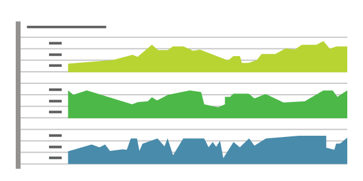

# What is Monitoring?
> By: Sam Guckenheimer

Monitoring provides feedback from production. Monitoring delivers
information about an application’s performance and usage patterns.

One goal of monitoring is to achieve high availability by minimizing
time to detect and time to mitigate (TTD, TTM). In other words, as soon
as performance and other issues arise, rich diagnostic data about the
issues are fed back to development teams via automated monitoring.
That’s TTD. DevOps teams act on the information to mitigate the issues
as quickly as possible so that users are no longer affected. That’s TTM.
Resolution times are measured, and teams work to improve over time.
After mitigation, teams work on how to remediate problems at root cause
so that they do not recur. That time is measured as TTR.

A second goal of monitoring is to enable “validated learning” by
tracking usage. The core concept of validated learning is that every
deployment is an opportunity to track experimental results that support
or diminish the hypotheses that led to the deployment. Tracking usage
and differences between versions allows teams to measure the impact of
change and drive business decisions. If a hypothesis is diminished, the
team can “fail fast” or “pivot”. If the hypothesis is supported, then
the team can double down or “persevere”. These data-informed decisions
lead to new hypotheses and prioritization of the backlog.

“Telemetry” is the mechanism for collecting data from monitoring.
Telemetry can use agents that are installed in the deployment
environments, an SDK that relies on markers inserted into source code,
server logging, or a combination of these. Typically, telemetry will
distinguish between the data pipeline optimized for real-time alerting
and dashboards and higher-volume data needed for troubleshooting or
usage analytics.

“Synthetic monitoring” uses a consistent set of transactions to assess
performance and availability. Synthetic transactions are predictable
tests that have the advantage of allowing comparison from release to
release in a highly predictable manner. Real User Monitoring (RUM), on
the other hand, means measurement of experience from the user’s browser,
mobile device or desktop, and accounts for “last mile” conditions such
as cellular networks, internet routing, and caching. Unlike synthetics,
RUM typically does not provide repeatable measurement over time.

Monitoring is often used to “test in production”. A well-monitored
deployment streams the data about its health and performance so that the
team can spot production incidents immediately. Combined with a
Continuous Deployment Release Pipeline, monitoring will detect new
anomalies and allow for prompt mitigation. This allows discovery of the
“unknown unknowns” in application behavior that cannot be foreseen in
pre-production environments.

Effective monitoring is essential to allow DevOps teams to deliver at
speed, get feedback from production, and increase customers
satisfaction, acquisition and retention.

Read more about the monitoring capabilities of [Application Insights](https://visualstudio.microsoft.com/application-insights/).

Learn how to set up and use [Application Insights for monitoring](https://azure.microsoft.com/en-us/documentation/articles/app-insights-overview/).

|             |                           |
|-------------|---------------------------|
||Sam Guckenheimer works on Microsoft Visual Studio Cloud Services, including VS Team Services and Team Foundation Server. He acts as the chief customer advocate, responsible for strategy of the next releases of these products, focusing on DevOps. He has written four books on DevOps and Agile Software practices.|